# Schéma de Base de Données - Chronique des Mondes

Ce document présente le schéma de base de données actuel et les évolutions prévues pour les systèmes de sorts et équipements.

## 📊 Vue d'ensemble

### État Actuel vs Prévu

```mermaid
erDiagram
    %% ========================================
    %% TABLES ACTUELLEMENT IMPLÉMENTÉES ✅
    %% ========================================
    
    Users {
        int Id PK
        string UserName
        string UserEmail
        string Password
    }
    
    Characters {
        int Id PK
        int UserId FK
        string Name
        string Picture
        string Background
        int Life
        int Leveling
        string GameType
    }
    
    CharactersDnd {
        int Id PK
        int UserId FK
        string Class
        int ClassArmor
        int Strong
        int AdditionalStrong
        int Dexterity
        int AdditionalDexterity
        int Constitution
        int AdditionalConstitution
        int Intelligence
        int AdditionalIntelligence
        int Wisdoms
        int AdditionalWisdoms
        int Charism
        int AdditionalCharism
    }
    
    %% ========================================
    %% NOUVELLES TABLES À CRÉER 🚧
    %% ========================================
    
    Spells {
        int Id PK
        string Name
        string Description
        string ImageUrl
        string GameType
        int CreatedByUserId FK
        bool IsPublic
        json Tags
        json DndProperties
        json SkyrimProperties
        json GenericProperties
        datetime CreatedAt
        datetime UpdatedAt
    }
    
    Equipment {
        int Id PK
        string Name
        string Description
        string ImageUrl
        string GameType
        int CreatedByUserId FK
        bool IsPublic
        json Tags
        json DndProperties
        json GenericProperties
        datetime CreatedAt
        datetime UpdatedAt
    }
    
    Campaigns {
        int Id PK
        string Name
        string Description
        string GameType
        int GameMasterId FK
        bool IsPublic
        int CurrentChapterId FK
        datetime CreatedAt
        datetime UpdatedAt
    }
    
    Chapters {
        int Id PK
        int CampaignId FK
        int ChapterNumber
        string Title
        string Content
        int OrderIndex
        string Status
        datetime CreatedAt
        datetime UpdatedAt
    }
    
    NPCs {
        int Id PK
        int ChapterId FK
        string Name
        string Description
        string GameType
        json DndProperties
        json GenericProperties
        datetime CreatedAt
    }
    
    CampaignPlayers {
        int CampaignId FK
        int UserId FK
        string Status
        datetime JoinedAt
        datetime InvitedAt
        bool IsActive
    }
    
    %% ========================================
    %% NOUVELLES TABLES SESSIONS 🆕
    %% ========================================
    
    Sessions {
        string SessionId PK
        int CampaignId FK
        int GameMasterId FK
        string Status
        datetime StartedAt
        datetime EndedAt
        int CurrentChapterId FK
        json SessionSettings
        datetime LastSavedAt
    }
    
    SessionParticipants {
        string SessionId FK
        int UserId FK
        int CharacterId FK
        string Status
        datetime JoinedAt
        datetime LastSeenAt
        bool IsOnline
    }
    
    CampaignInvitations {
        int Id PK
        int CampaignId FK
        int InviterId FK
        string InviteeEmail
        int InviteeUserId FK
        string Status
        string Message
        datetime CreatedAt
        datetime ExpiresAt
        datetime RespondedAt
    }
    
    CampaignProgress {
        int CampaignId FK
        int UserId FK
        int CurrentChapterId FK
        int CompletedChapters
        int TotalChapters
        decimal ProgressPercentage
        datetime LastUpdated
    }
    
    SessionSaves {
        int Id PK
        string SessionId FK
        int SaveSlot
        json GameState
        int ChapterId FK
        string Description
        datetime CreatedAt
    }
    
    Combats {
        int Id PK
        string SessionId FK
        int ChapterId FK
        string Status
        int CurrentTurn
        json TurnOrder
        datetime StartedAt
        datetime EndedAt
    }
    
    CombatParticipants {
        int CombatId FK
        int ParticipantId
        string ParticipantType
        int CharacterId FK
        int NpcId FK
        int Initiative
        int CurrentHitPoints
        json StatusEffects
        bool IsActive
    }
    
    Notifications {
        int Id PK
        int UserId FK
        string Type
        string Title
        string Message
        json Data
        bool IsRead
        string DeliveryMethod
        datetime CreatedAt
        datetime ReadAt
        datetime ExpiresAt
    }
    
    PasswordResets {
        int Id PK
        int UserId FK
        string ResetToken
        datetime CreatedAt
        datetime ExpiresAt
        bool IsUsed
        datetime UsedAt
    }
    
    %% ========================================
    %% RELATIONS
    %% ========================================
    
    Users ||--o{ Characters : "possède"
    Users ||--o{ CharactersDnd : "possède"
    Users ||--o{ Spells : "crée"
    Users ||--o{ Equipment : "crée"
    Users ||--o{ Campaigns : "maîtrise"
    Users ||--o{ CampaignPlayers : "participe"
    Users ||--o{ Sessions : "organise"
    Users ||--o{ SessionParticipants : "participe"
    Users ||--o{ CampaignInvitations : "invite"
    Users ||--o{ CampaignInvitations : "invité"
    Users ||--o{ Notifications : "reçoit"
    Users ||--o{ PasswordResets : "demande"
    
    Campaigns ||--o{ Chapters : "contient"
    Campaigns ||--o{ CampaignPlayers : "accueille"
    Campaigns ||--o{ EquipmentOffers : "facilite"
    Campaigns ||--o{ EquipmentTrades : "permet"
    Campaigns ||--o{ Sessions : "héberge"
    Campaigns ||--o{ CampaignInvitations : "concerne"
    Campaigns ||--o{ CampaignProgress : "progresse"
    
    Chapters ||--o{ NPCs : "contient"
    Chapters ||--o{ Combats : "propose"
    
    Sessions ||--o{ SessionParticipants : "inclut"
    Sessions ||--o{ SessionSaves : "sauvegarde"
    Sessions ||--o{ Combats : "contient"
    
    Combats ||--o{ CombatParticipants : "implique"
    
    Characters ||--o{ CharacterSpells : "connaît"
    Characters ||--o{ CharacterEquipment : "possède"
    Characters ||--o{ SessionParticipants : "joue"
    Characters ||--o{ CombatParticipants : "combat"
    
    Spells ||--o{ CharacterSpells : "appris par"
    Equipment ||--o{ CharacterEquipment : "possédé par"
    Equipment ||--o{ EquipmentOffers : "proposé"
    Equipment ||--o{ EquipmentTrades : "échangé"
```



## 🏗️ Détail des Tables

### Tables Actuellement Implémentées ✅

#### **Users**
```sql
CREATE TABLE Users (
    Id int IDENTITY(1,1) PRIMARY KEY,
    UserName nvarchar(20) NOT NULL,
    UserEmail nvarchar(255) NOT NULL,
    Password nvarchar(255) NOT NULL,
    
    CONSTRAINT UQ_Users_UserEmail UNIQUE (UserEmail)
);
```

#### **Characters (Abstrait)**
```sql
-- Note: Cette table existe conceptuellement via l'héritage EF
-- Les propriétés communes sont dans les tables dérivées
```

#### **CharactersDnd**
```sql
CREATE TABLE CharactersDnd (
    Id int IDENTITY(1,1) PRIMARY KEY,
    UserId int NOT NULL,
    Name nvarchar(100) NOT NULL,
    Picture nvarchar(255),
    Background nvarchar(max),
    Life int NOT NULL DEFAULT 0,
    Leveling int NOT NULL DEFAULT 1,
    
    -- Propriétés D&D spécifiques
    Class nvarchar(50) NOT NULL,
    ClassArmor int NOT NULL DEFAULT 10,
    Strong int NOT NULL DEFAULT 10,
    AdditionalStrong int NOT NULL DEFAULT 0,
    Dexterity int NOT NULL DEFAULT 10,
    AdditionalDexterity int NOT NULL DEFAULT 0,
    Constitution int NOT NULL DEFAULT 10,
    AdditionalConstitution int NOT NULL DEFAULT 0,
    Intelligence int NOT NULL DEFAULT 10,
    AdditionalIntelligence int NOT NULL DEFAULT 0,
    Wisdoms int NOT NULL DEFAULT 10,
    AdditionalWisdoms int NOT NULL DEFAULT 0,
    Charism int NOT NULL DEFAULT 10,
    AdditionalCharism int NOT NULL DEFAULT 0,
    
    CONSTRAINT FK_CharactersDnd_Users FOREIGN KEY (UserId) REFERENCES Users(Id)
);
```

### Nouvelles Tables à Créer 🚧

#### **Spells**
```sql
CREATE TABLE Spells (
    Id int IDENTITY(1,1) PRIMARY KEY,
    Name nvarchar(100) NOT NULL,
    Description nvarchar(max) NOT NULL,
    ImageUrl nvarchar(255),
    GameType nvarchar(20) NOT NULL DEFAULT 'generic',
    CreatedByUserId int NOT NULL, -- 0 = Administrateur
    IsPublic bit NOT NULL DEFAULT 0,
    Tags nvarchar(max), -- JSON array
    
    -- Propriétés spécialisées stockées en JSON
    DndProperties nvarchar(max), -- JSON pour propriétés D&D
    SkyrimProperties nvarchar(max), -- JSON pour propriétés Skyrim
    GenericProperties nvarchar(max), -- JSON pour propriétés génériques
    
    CreatedAt datetime2 NOT NULL DEFAULT GETDATE(),
    UpdatedAt datetime2 NOT NULL DEFAULT GETDATE(),
    
    CONSTRAINT FK_Spells_Users FOREIGN KEY (CreatedByUserId) REFERENCES Users(Id),
    CONSTRAINT CK_Spells_GameType CHECK (GameType IN ('generic', 'dnd', 'skyrim'))
);

-- Index pour optimiser les requêtes
CREATE INDEX IX_Spells_GameType_IsPublic ON Spells (GameType, IsPublic);
CREATE INDEX IX_Spells_CreatedByUserId ON Spells (CreatedByUserId);
```

**Exemple de DndProperties JSON :**
```json
{
  "level": 3,
  "school": "Évocation",
  "castingTime": "1 action",
  "range": "45 mètres",
  "duration": "Instantané",
  "components": ["V", "S", "M"],
  "damageFormula": "8d6",
  "requiresAttackRoll": false,
  "requiresSavingThrow": true,
  "savingThrowAbility": "Dextérité"
}
```

#### **Equipment**
```sql
CREATE TABLE Equipment (
    Id int IDENTITY(1,1) PRIMARY KEY,
    Name nvarchar(100) NOT NULL,
    Description nvarchar(max) NOT NULL,
    ImageUrl nvarchar(255),
    GameType nvarchar(20) NOT NULL DEFAULT 'generic',
    CreatedByUserId int NOT NULL, -- 0 = Administrateur
    IsPublic bit NOT NULL DEFAULT 0,
    Tags nvarchar(max), -- JSON array
    
    -- Propriétés spécialisées stockées en JSON
    DndProperties nvarchar(max), -- JSON pour propriétés D&D
    GenericProperties nvarchar(max), -- JSON pour propriétés génériques
    
    CreatedAt datetime2 NOT NULL DEFAULT GETDATE(),
    UpdatedAt datetime2 NOT NULL DEFAULT GETDATE(),
    
    CONSTRAINT FK_Equipment_Users FOREIGN KEY (CreatedByUserId) REFERENCES Users(Id),
    CONSTRAINT CK_Equipment_GameType CHECK (GameType IN ('generic', 'dnd', 'skyrim'))
);

-- Index pour optimiser les requêtes
CREATE INDEX IX_Equipment_GameType_IsPublic ON Equipment (GameType, IsPublic);
CREATE INDEX IX_Equipment_CreatedByUserId ON Equipment (CreatedByUserId);
```

**Exemple de DndProperties JSON :**
```json
{
  "equipmentType": "Weapon",
  "weaponCategory": "Martial",
  "damageFormula": "1d8 + mod",
  "damageType": "Tranchant",
  "properties": ["Versatile (1d10)", "Finesse"],
  "rarity": "Commun",
  "requiresAttunement": false,
  "armorClassBase": null,
  "armorClassDexBonus": null
}
```

#### **Campaigns**
```sql
CREATE TABLE Campaigns (
    Id int IDENTITY(1,1) PRIMARY KEY,
    Name nvarchar(100) NOT NULL,
    Description nvarchar(max),
    GameType nvarchar(20) NOT NULL DEFAULT 'generic',
    GameMasterId int NOT NULL,
    IsPublic bit NOT NULL DEFAULT 0,
    CurrentChapterId int,
    
    CreatedAt datetime2 NOT NULL DEFAULT GETDATE(),
    UpdatedAt datetime2 NOT NULL DEFAULT GETDATE(),
    
    CONSTRAINT FK_Campaigns_GameMaster FOREIGN KEY (GameMasterId) REFERENCES Users(Id),
    CONSTRAINT CK_Campaigns_GameType CHECK (GameType IN ('generic', 'dnd', 'skyrim'))
);
```

#### **Chapters**
```sql
CREATE TABLE Chapters (
    Id int IDENTITY(1,1) PRIMARY KEY,
    CampaignId int NOT NULL,
    ChapterNumber int NOT NULL,
    Title nvarchar(100) NOT NULL,
    Content nvarchar(max),
    OrderIndex int,
    Status nvarchar(20) NOT NULL DEFAULT 'Pending',
    
    CreatedAt datetime2 NOT NULL DEFAULT GETDATE(),
    UpdatedAt datetime2 NOT NULL DEFAULT GETDATE(),
    
    CONSTRAINT FK_Chapters_Campaigns FOREIGN KEY (CampaignId) REFERENCES Campaigns(Id),
    CONSTRAINT CK_Chapters_Status CHECK (Status IN ('Pending', 'Active', 'Completed')),
    CONSTRAINT UQ_Chapters_CampaignId_ChapterNumber UNIQUE (CampaignId, ChapterNumber)
);
```

#### **CharacterSpells (Table de liaison)**
```sql
CREATE TABLE CharacterSpells (
    CharacterId int NOT NULL,
    SpellId int NOT NULL,
    LearnedDate datetime2 NOT NULL DEFAULT GETDATE(),
    IsPrepared bit NOT NULL DEFAULT 1,
    Notes nvarchar(500),
    
    CONSTRAINT PK_CharacterSpells PRIMARY KEY (CharacterId, SpellId),
    CONSTRAINT FK_CharacterSpells_Character FOREIGN KEY (CharacterId) REFERENCES CharactersDnd(Id),
    CONSTRAINT FK_CharacterSpells_Spell FOREIGN KEY (SpellId) REFERENCES Spells(Id)
);
```

#### **CharacterEquipment (Table de liaison)**
```sql
CREATE TABLE CharacterEquipment (
    CharacterId int NOT NULL,
    EquipmentId int NOT NULL,
    Quantity int NOT NULL DEFAULT 1,
    IsEquipped bit NOT NULL DEFAULT 0,
    CustomProperties nvarchar(max), -- JSON pour propriétés custom
    AcquiredDate datetime2 NOT NULL DEFAULT GETDATE(),
    
    CONSTRAINT PK_CharacterEquipment PRIMARY KEY (CharacterId, EquipmentId),
    CONSTRAINT FK_CharacterEquipment_Character FOREIGN KEY (CharacterId) REFERENCES CharactersDnd(Id),
    CONSTRAINT FK_CharacterEquipment_Equipment FOREIGN KEY (EquipmentId) REFERENCES Equipment(Id),
    CONSTRAINT CK_CharacterEquipment_Quantity CHECK (Quantity > 0)
);
```

#### **EquipmentOffers (Propositions MJ → Joueur)**
```sql
CREATE TABLE EquipmentOffers (
    Id int IDENTITY(1,1) PRIMARY KEY,
    CampaignId int NOT NULL,
    GameMasterId int NOT NULL,
    TargetPlayerId int NOT NULL,
    EquipmentId int NOT NULL,
    Quantity int NOT NULL DEFAULT 1,
    Message nvarchar(500),
    Status nvarchar(20) NOT NULL DEFAULT 'Pending',
    
    CreatedAt datetime2 NOT NULL DEFAULT GETDATE(),
    RespondedAt datetime2,
    
    CONSTRAINT FK_EquipmentOffers_Campaign FOREIGN KEY (CampaignId) REFERENCES Campaigns(Id),
    CONSTRAINT FK_EquipmentOffers_GameMaster FOREIGN KEY (GameMasterId) REFERENCES Users(Id),
    CONSTRAINT FK_EquipmentOffers_TargetPlayer FOREIGN KEY (TargetPlayerId) REFERENCES Users(Id),
    CONSTRAINT FK_EquipmentOffers_Equipment FOREIGN KEY (EquipmentId) REFERENCES Equipment(Id),
    CONSTRAINT CK_EquipmentOffers_Status CHECK (Status IN ('Pending', 'Accepted', 'Declined', 'Cancelled'))
);
```

#### **EquipmentTrades (Échanges Joueur → Joueur)**
```sql
CREATE TABLE EquipmentTrades (
    Id int IDENTITY(1,1) PRIMARY KEY,
    CampaignId int NOT NULL,
    FromPlayerId int NOT NULL,
    ToPlayerId int NOT NULL,
    EquipmentId int NOT NULL,
    Quantity int NOT NULL DEFAULT 1,
    Message nvarchar(500),
    Status nvarchar(20) NOT NULL DEFAULT 'Proposed',
    
    CreatedAt datetime2 NOT NULL DEFAULT GETDATE(),
    CompletedAt datetime2,
    
    CONSTRAINT FK_EquipmentTrades_Campaign FOREIGN KEY (CampaignId) REFERENCES Campaigns(Id),
    CONSTRAINT FK_EquipmentTrades_FromPlayer FOREIGN KEY (FromPlayerId) REFERENCES Users(Id),
    CONSTRAINT FK_EquipmentTrades_ToPlayer FOREIGN KEY (ToPlayerId) REFERENCES Users(Id),
    CONSTRAINT FK_EquipmentTrades_Equipment FOREIGN KEY (EquipmentId) REFERENCES Equipment(Id),
    CONSTRAINT CK_EquipmentTrades_Status CHECK (Status IN ('Proposed', 'Accepted', 'Declined', 'Completed', 'Cancelled')),
    CONSTRAINT CK_EquipmentTrades_DifferentPlayers CHECK (FromPlayerId != ToPlayerId)
);
```

#### **Sessions (Gestion des Séances de Jeu)**
```sql
CREATE TABLE Sessions (
    SessionId nvarchar(50) PRIMARY KEY,  -- Format: sess_abc123
    CampaignId int NOT NULL,
    GameMasterId int NOT NULL,
    Status nvarchar(20) NOT NULL DEFAULT 'active',
    StartedAt datetime2 NOT NULL DEFAULT GETDATE(),
    EndedAt datetime2,
    CurrentChapterId int,
    SessionSettings nvarchar(max),  -- JSON: autosave, notifications, etc.
    LastSavedAt datetime2,
    
    CONSTRAINT FK_Sessions_Campaign FOREIGN KEY (CampaignId) REFERENCES Campaigns(Id),
    CONSTRAINT FK_Sessions_GameMaster FOREIGN KEY (GameMasterId) REFERENCES Users(Id),
    CONSTRAINT FK_Sessions_CurrentChapter FOREIGN KEY (CurrentChapterId) REFERENCES Chapters(Id),
    CONSTRAINT CK_Sessions_Status CHECK (Status IN ('active', 'paused', 'ended', 'waiting'))
);

CREATE INDEX IX_Sessions_Campaign_Status ON Sessions (CampaignId, Status);
```

#### **SessionParticipants (Participants aux Sessions)**
```sql
CREATE TABLE SessionParticipants (
    SessionId nvarchar(50) NOT NULL,
    UserId int NOT NULL,
    CharacterId int NOT NULL,
    Status nvarchar(20) NOT NULL DEFAULT 'invited',
    JoinedAt datetime2,
    LastSeenAt datetime2,
    IsOnline bit NOT NULL DEFAULT 0,
    
    CONSTRAINT PK_SessionParticipants PRIMARY KEY (SessionId, UserId),
    CONSTRAINT FK_SessionParticipants_Session FOREIGN KEY (SessionId) REFERENCES Sessions(SessionId),
    CONSTRAINT FK_SessionParticipants_User FOREIGN KEY (UserId) REFERENCES Users(Id),
    CONSTRAINT FK_SessionParticipants_Character FOREIGN KEY (CharacterId) REFERENCES CharactersDnd(Id),
    CONSTRAINT CK_SessionParticipants_Status CHECK (Status IN ('invited', 'joined', 'declined', 'disconnected'))
);
```

#### **CampaignInvitations (Invitations aux Campagnes)**
```sql
CREATE TABLE CampaignInvitations (
    Id int IDENTITY(1,1) PRIMARY KEY,
    CampaignId int NOT NULL,
    InviterId int NOT NULL,
    InviteeEmail nvarchar(255),
    InviteeUserId int,  -- Si utilisateur existant
    Status nvarchar(20) NOT NULL DEFAULT 'pending',
    Message nvarchar(500),
    CreatedAt datetime2 NOT NULL DEFAULT GETDATE(),
    ExpiresAt datetime2 NOT NULL,
    RespondedAt datetime2,
    
    CONSTRAINT FK_CampaignInvitations_Campaign FOREIGN KEY (CampaignId) REFERENCES Campaigns(Id),
    CONSTRAINT FK_CampaignInvitations_Inviter FOREIGN KEY (InviterId) REFERENCES Users(Id),
    CONSTRAINT FK_CampaignInvitations_Invitee FOREIGN KEY (InviteeUserId) REFERENCES Users(Id),
    CONSTRAINT CK_CampaignInvitations_Status CHECK (Status IN ('pending', 'accepted', 'declined', 'expired')),
    CONSTRAINT CK_CampaignInvitations_Contact CHECK (InviteeEmail IS NOT NULL OR InviteeUserId IS NOT NULL)
);
```

#### **CampaignProgress (Progression des Campagnes)**
```sql
CREATE TABLE CampaignProgress (
    CampaignId int NOT NULL,
    UserId int NOT NULL,
    CurrentChapterId int,
    CompletedChapters int NOT NULL DEFAULT 0,
    TotalChapters int NOT NULL DEFAULT 0,
    ProgressPercentage decimal(5,2) NOT NULL DEFAULT 0.00,
    LastUpdated datetime2 NOT NULL DEFAULT GETDATE(),
    
    CONSTRAINT PK_CampaignProgress PRIMARY KEY (CampaignId, UserId),
    CONSTRAINT FK_CampaignProgress_Campaign FOREIGN KEY (CampaignId) REFERENCES Campaigns(Id),
    CONSTRAINT FK_CampaignProgress_User FOREIGN KEY (UserId) REFERENCES Users(Id),
    CONSTRAINT FK_CampaignProgress_CurrentChapter FOREIGN KEY (CurrentChapterId) REFERENCES Chapters(Id),
    CONSTRAINT CK_CampaignProgress_Percentage CHECK (ProgressPercentage >= 0 AND ProgressPercentage <= 100)
);
```

#### **SessionSaves (Sauvegardes de Session)**
```sql
CREATE TABLE SessionSaves (
    Id int IDENTITY(1,1) PRIMARY KEY,
    SessionId nvarchar(50) NOT NULL,
    SaveSlot int NOT NULL,
    GameState nvarchar(max) NOT NULL,  -- JSON complet de l'état
    ChapterId int NOT NULL,
    Description nvarchar(200),
    CreatedAt datetime2 NOT NULL DEFAULT GETDATE(),
    
    CONSTRAINT FK_SessionSaves_Session FOREIGN KEY (SessionId) REFERENCES Sessions(SessionId),
    CONSTRAINT FK_SessionSaves_Chapter FOREIGN KEY (ChapterId) REFERENCES Chapters(Id),
    CONSTRAINT UQ_SessionSaves_Slot UNIQUE (SessionId, SaveSlot),
    CONSTRAINT CK_SessionSaves_Slot CHECK (SaveSlot >= 1 AND SaveSlot <= 10)
);
```

#### **Combats (Sessions de Combat)**
```sql
CREATE TABLE Combats (
    Id int IDENTITY(1,1) PRIMARY KEY,
    SessionId nvarchar(50) NOT NULL,
    ChapterId int NOT NULL,
    Status nvarchar(20) NOT NULL DEFAULT 'initiative',
    CurrentTurn int NOT NULL DEFAULT 1,
    TurnOrder nvarchar(max),  -- JSON ordre des tours
    StartedAt datetime2 NOT NULL DEFAULT GETDATE(),
    EndedAt datetime2,
    
    CONSTRAINT FK_Combats_Session FOREIGN KEY (SessionId) REFERENCES Sessions(SessionId),
    CONSTRAINT FK_Combats_Chapter FOREIGN KEY (ChapterId) REFERENCES Chapters(Id),
    CONSTRAINT CK_Combats_Status CHECK (Status IN ('initiative', 'active', 'paused', 'ended'))
);
```

#### **CombatParticipants (Participants aux Combats)**
```sql
CREATE TABLE CombatParticipants (
    CombatId int NOT NULL,
    ParticipantId int NOT NULL,
    ParticipantType nvarchar(10) NOT NULL,
    CharacterId int,  -- Si joueur
    NpcId int,        -- Si PNJ/monstre
    Initiative int NOT NULL,
    CurrentHitPoints int NOT NULL,
    MaxHitPoints int NOT NULL,
    StatusEffects nvarchar(max),  -- JSON effets actifs
    IsActive bit NOT NULL DEFAULT 1,
    
    CONSTRAINT PK_CombatParticipants PRIMARY KEY (CombatId, ParticipantId),
    CONSTRAINT FK_CombatParticipants_Combat FOREIGN KEY (CombatId) REFERENCES Combats(Id),
    CONSTRAINT FK_CombatParticipants_Character FOREIGN KEY (CharacterId) REFERENCES CharactersDnd(Id),
    CONSTRAINT FK_CombatParticipants_Npc FOREIGN KEY (NpcId) REFERENCES NPCs(Id),
    CONSTRAINT CK_CombatParticipants_Type CHECK (ParticipantType IN ('player', 'npc')),
    CONSTRAINT CK_CombatParticipants_Reference CHECK (
        (ParticipantType = 'player' AND CharacterId IS NOT NULL AND NpcId IS NULL) OR
        (ParticipantType = 'npc' AND CharacterId IS NULL AND NpcId IS NOT NULL)
    )
);
```

#### **Notifications (Système de Notifications)**
```sql
CREATE TABLE Notifications (
    Id int IDENTITY(1,1) PRIMARY KEY,
    UserId int NOT NULL,
    Type nvarchar(50) NOT NULL,
    Title nvarchar(100) NOT NULL,
    Message nvarchar(500) NOT NULL,
    Data nvarchar(max),  -- JSON données contextuelles
    IsRead bit NOT NULL DEFAULT 0,
    DeliveryMethod nvarchar(20) NOT NULL DEFAULT 'websocket',
    CreatedAt datetime2 NOT NULL DEFAULT GETDATE(),
    ReadAt datetime2,
    ExpiresAt datetime2,
    
    CONSTRAINT FK_Notifications_User FOREIGN KEY (UserId) REFERENCES Users(Id),
    CONSTRAINT CK_Notifications_Type CHECK (Type IN ('session_started', 'your_turn', 'combat_invite', 'campaign_invite', 'equipment_offer')),
    CONSTRAINT CK_Notifications_DeliveryMethod CHECK (DeliveryMethod IN ('websocket', 'email', 'both'))
);

-- Index pour les notifications non lues
CREATE INDEX IX_Notifications_User_Unread ON Notifications (UserId, IsRead, CreatedAt);
```

#### **PasswordResets (Réinitialisation Mots de Passe)**
```sql
CREATE TABLE PasswordResets (
    Id int IDENTITY(1,1) PRIMARY KEY,
    UserId int NOT NULL,
    ResetToken nvarchar(100) NOT NULL,
    CreatedAt datetime2 NOT NULL DEFAULT GETDATE(),
    ExpiresAt datetime2 NOT NULL,
    IsUsed bit NOT NULL DEFAULT 0,
    UsedAt datetime2,
    
    CONSTRAINT FK_PasswordResets_User FOREIGN KEY (UserId) REFERENCES Users(Id),
    CONSTRAINT UQ_PasswordResets_Token UNIQUE (ResetToken)
);

-- Index pour nettoyage automatique des tokens expirés
CREATE INDEX IX_PasswordResets_Expiry ON PasswordResets (ExpiresAt, IsUsed);
```

## 🔄 Migrations Prévues

### Migration 1 : Tables de Base
```bash
dotnet ef migrations add CreateSpellsAndEquipmentTables
```
- Création des tables `Spells` et `Equipment`
- Index pour optimisation des requêtes

### Migration 2 : Système d'Apprentissage
```bash
dotnet ef migrations add CreateCharacterSpellsRelation
```
- Création de la table `CharacterSpells`
- Relations avec validation

### Migration 3 : Système d'Inventaire
```bash
dotnet ef migrations add CreateCharacterEquipmentRelation
```
- Création de la table `CharacterEquipment`
- Support des quantités multiples

### Migration 4 : Système d'Échanges
```bash
dotnet ef migrations add CreateEquipmentExchangeSystem
```
- Création des tables `EquipmentOffers` et `EquipmentTrades`
- Contraintes de validation des échanges

### Migration 5 : Campagnes et Chapitres
```bash
dotnet ef migrations add CreateCampaignsAndChapters
```
- Système complet de gestion des campagnes
- Tables `Campaigns`, `Chapters`, `NPCs`, `CampaignPlayers`

### Migration 6 : Système de Sessions ✨ NOUVEAU
```bash
dotnet ef migrations add CreateSessionsSystem
```
- Création des tables `Sessions` et `SessionParticipants`
- Support du lancement et gestion des sessions temps réel

### Migration 7 : Système de Notifications
```bash
dotnet ef migrations add CreateNotificationsSystem  
```
- Création de la table `Notifications`
- Support WebSocket et email pour alertes en temps réel

### Migration 8 : Invitations et Progression
```bash
dotnet ef migrations add CreateInvitationsAndProgress
```
- Création des tables `CampaignInvitations` et `CampaignProgress`
- Système complet d'invitations et suivi de progression

### Migration 9 : Combat Temps Réel
```bash
dotnet ef migrations add CreateRealTimeCombat
```
- Création des tables `Combats` et `CombatParticipants`
- Support des combats synchronisés avec invitations dynamiques

### Migration 10 : Authentification Avancée
```bash
dotnet ef migrations add CreatePasswordResets
```
- Création de la table `PasswordResets`
- Système complet de réinitialisation de mots de passe

## 📈 Données de Test

### Scripts d'Injection Administrative

#### **Sorts D&D Officiels**
```sql
-- Sorts de niveau 1
INSERT INTO Spells (Name, Description, GameType, CreatedByUserId, IsPublic, DndProperties)
VALUES 
('Projectile Magique', 'Trois projectiles d''énergie pure frappent automatiquement leurs cibles.', 'dnd', 0, 1, 
 '{"level":1,"school":"Évocation","castingTime":"1 action","range":"36 mètres","duration":"Instantané","components":["V","S"],"damageFormula":"1d4+1","requiresAttackRoll":true}'),

('Soin', 'Restaure instantanément les points de vie de la cible.', 'dnd', 0, 1,
 '{"level":1,"school":"Évocation","castingTime":"1 action","range":"Contact","duration":"Instantané","components":["V","S"],"damageFormula":"1d8+mod","requiresAttackRoll":false}');

-- Sorts de niveau 3
INSERT INTO Spells (Name, Description, GameType, CreatedByUserId, IsPublic, DndProperties)
VALUES 
('Boule de Feu', 'Une explosion de flammes dévastatrice dans une zone de 6 mètres de rayon.', 'dnd', 0, 1,
 '{"level":3,"school":"Évocation","castingTime":"1 action","range":"45 mètres","duration":"Instantané","components":["V","S","M"],"damageFormula":"8d6","requiresSavingThrow":true,"savingThrowAbility":"Dextérité"}');
```

#### **Équipements D&D Officiels**
```sql
-- Armes
INSERT INTO Equipment (Name, Description, GameType, CreatedByUserId, IsPublic, DndProperties)
VALUES 
('Épée Longue', 'Arme martiale polyvalente à une main.', 'dnd', 0, 1,
 '{"equipmentType":"Weapon","weaponCategory":"Martial","damageFormula":"1d8","damageType":"Tranchant","properties":["Versatile (1d10)"],"rarity":"Commun"}'),

('Dague', 'Arme simple légère et précise.', 'dnd', 0, 1,
 '{"equipmentType":"Weapon","weaponCategory":"Simple","damageFormula":"1d4","damageType":"Perforant","properties":["Finesse","Light","Thrown (6/18)"],"rarity":"Commun"}');

-- Armures
INSERT INTO Equipment (Name, Description, GameType, CreatedByUserId, IsPublic, DndProperties)
VALUES 
('Armure de Cuir', 'Armure légère flexible et silencieuse.', 'dnd', 0, 1,
 '{"equipmentType":"Armor","armorCategory":"Light","armorClassBase":11,"armorClassDexBonus":10,"rarity":"Commun"}'),

('Cotte de Mailles', 'Armure intermédiaire offrant une bonne protection.', 'dnd', 0, 1,
 '{"equipmentType":"Armor","armorCategory":"Medium","armorClassBase":13,"armorClassDexBonus":2,"rarity":"Commun"}');

-- Consommables
INSERT INTO Equipment (Name, Description, GameType, CreatedByUserId, IsPublic, DndProperties)
VALUES 
('Potion de Soins', 'Récupère des points de vie instantanément.', 'dnd', 0, 1,
 '{"equipmentType":"Consumable","properties":["Healing 2d4+2"],"rarity":"Commun"}');
```

#### **Campagnes et Chapitres Initiaux**
```sql
-- Campagne Test
INSERT INTO Campaigns (Name, Description, GameType, GameMasterId, IsPublic, CreatedAt, UpdatedAt)
VALUES 
('Campagne de Test', 'Une campagne passionnante pour tester les fonctionnalités.', 'dnd', 1, 1, GETDATE(), GETDATE());

-- Récupérer l''Id de la campagne créée
DECLARE @CampaignId int = SCOPE_IDENTITY();

-- Chapitre 1
INSERT INTO Chapters (CampaignId, ChapterNumber, Title, Content, OrderIndex, Status, CreatedAt, UpdatedAt)
VALUES 
(@CampaignId, 1, 'Chapitre d''Introduction', 'Contenu du chapitre d''introduction...', 1, 'Active', GETDATE(), GETDATE());

-- Chapitre 2
INSERT INTO Chapters (CampaignId, ChapterNumber, Title, Content, OrderIndex, Status, CreatedAt, UpdatedAt)
VALUES 
(@CampaignId, 2, 'Chapitre de Développement', 'Contenu du chapitre de développement...', 2, 'Pending', GETDATE(), GETDATE());
```

---

*Ce schéma évoluera au fur et à mesure du développement. Retour au [README principal](./README.md)*