# Schéma de Base de Données - Chronique des Mondes

Ce document présente le schéma de base de données actuel et les évolutions prévues pour le système de campagnes multi-jeux.

## 📊 Vue d'ensemble

### État Actuel vs Prévu

```mermaid
erDiagram
    %% ========================================
    %% TABLES ACTUELLEMENT IMPLÉMENTÉES ✅
    %% ========================================
    
    Users {
        int Id PK
        string UserName
        string UserEmail
        string Password
    }
    
    CharactersDnd {
        int Id PK
        int UserId FK
        string Name
        string Picture
        string Background
        int Life
        int Leveling
        string Class
        int ClassArmor
        int Strong
        int AdditionalStrong
        int Dexterity
        int AdditionalDexterity
        int Constitution
        int AdditionalConstitution
        int Intelligence
        int AdditionalIntelligence
        int Wisdoms
        int AdditionalWisdoms
        int Charism
        int AdditionalCharism
    }
    
    Campaigns {
        int Id PK
        string Name
        string Description
        int GameType
        int CreatedById FK
        bool IsPublic
        string Settings
        datetime CreatedDate
        datetime UpdatedDate
        bool IsActive
    }
    
    Chapters {
        int Id PK
        int CampaignId FK
        int Order
        string Title
        string Content
        bool IsActive
        datetime CreatedDate
        datetime UpdatedDate
        string Notes
    }
    
    NPCs {
        int Id PK
        int ChapterId FK
        string Name
        string Description
        string GameType
        json DndProperties
        json GenericProperties
        datetime CreatedAt
    }
    
    %% ========================================
    %% NOUVELLES TABLES À CRÉER 🚧
    %% ========================================
    
    ContentBlocks {
        int Id PK
        int ChapterId FK
        int Order
        string Type
        string Title
        string Content
        int NpcId FK
        string NpcMood
        json Tags
        bool IsActive
        datetime CreatedDate
        datetime UpdatedDate
    }
    
    CampaignPlayers {
        int CampaignId FK
        int UserId FK
        string Status
        datetime JoinedAt
        datetime InvitedAt
        bool IsActive
    }
    
    Sessions {
        string SessionId PK
        int CampaignId FK
        int GameMasterId FK
        string Status
        datetime StartedAt
        datetime EndedAt
        int CurrentChapterId FK
        json SessionSettings
        datetime LastSavedAt
    }
    
    SessionParticipants {
        string SessionId FK
        int UserId FK
        int CharacterId FK
        string Status
        datetime JoinedAt
        datetime LastSeenAt
        bool IsOnline
    }
    
    Combats {
        int Id PK
        string SessionId FK
        int ChapterId FK
        string Status
        int CurrentTurn
        json TurnOrder
        datetime StartedAt
        datetime EndedAt
    }
    
    CombatParticipants {
        int CombatId FK
        int ParticipantId
        string ParticipantType
        int CharacterId FK
        int NpcId FK
        int Initiative
        int CurrentHitPoints
        json StatusEffects
        bool IsActive
    }
    
    %% ========================================
    %% RELATIONS ENTRE LES TABLES
    %% ========================================
    
    %% Relations Campagnes
    Users ||--o{ Campaigns : "crée"
    Users ||--o{ CharactersDnd : "possède"
    Campaigns ||--o{ Chapters : "organise_en"
    Campaigns ||--o{ CampaignPlayers : "accueille"
    Campaigns ||--o{ Sessions : "héberge"
    
    %% Relations Chapitres et Contenu
    Chapters ||--o{ NPCs : "contient"
    Chapters ||--o{ ContentBlocks : "structure_avec"
    Chapters ||--o{ Combats : "propose"
    
    %% Relations Blocs de Contenu
    ContentBlocks }o--|| NPCs : "peut_lier_à"
    
    %% Relations Sessions et Combat
    Sessions ||--o{ SessionParticipants : "inclut"
    Sessions ||--o{ Combats : "gère_combats"
    
    %% Relations Combat
    Combats ||--o{ CombatParticipants : "implique"
    CombatParticipants }o--|| CharactersDnd : "joueur_ou"
    CombatParticipants }o--|| NPCs : "npc_hostile"
```



## 🎯 **Architecture Campagnes Multi-Jeux**

### 🏗️ **Flux de Création MJ**

1. **MJ crée une Campagne** 
   - Choisit le GameType (Generic, DnD, Skyrim)
   - Définit nom, description, visibilité

2. **MJ organise en Chapitres**
   - Crée plusieurs chapitres pour structurer l'histoire
   - Ordonne les chapitres pour le déroulement

3. **Dans chaque Chapitre, MJ ajoute :**
   - **NPCs disponibles** (créatures, personnages)
   - **Blocs de contenu** pour organiser l'information

4. **Types de Blocs de Contenu :**
   - 🏠 **Bloc Lieu** : Description d'un endroit
   - 💬 **Bloc Dialogue NPC** : Conversation avec un NPC + humeur
   - 📝 **Bloc Description** : Texte libre narratif  
   - ⚡ **Bloc Événement** : Action ou situation spécifique

### 🎮 **Flux de Session de Jeu**

1. **MJ** lance une Session
2. **Joueurs rejoignent** avec leurs personnages
3. **MJ navigue** entre ses blocs de contenu préparés
4. **Combat déclenché** : NPCs du chapitre proposés automatiquement
5. **Système propose** les NPCs hostiles liés au chapitre
6. **Pop-up envoyée** aux joueurs pour rejoindre le combat

### 💬 **Gestion des Dialogues NPC**

Le MJ peut créer **plusieurs blocs de dialogue** pour un même NPC avec différentes **humeurs** :

- **Hostile** : "Que fais-tu ici, intrus ?"
- **Neutre** : "Bonjour, que puis-je faire pour vous ?"  
- **Amical** : "Mes amis ! Comme je suis heureux de vous voir !"

Cela permet au MJ de **s'adapter** aux actions des joueurs ou de préparer **plusieurs scénarios**.

## 🏗️ Détail des Tables

### Tables Actuellement Implémentées ✅

#### **Users**
```sql
CREATE TABLE Users (
    Id int IDENTITY(1,1) PRIMARY KEY,
    UserName nvarchar(20) NOT NULL,
    UserEmail nvarchar(255) NOT NULL,
    Password nvarchar(255) NOT NULL,
    
    CONSTRAINT UQ_Users_UserEmail UNIQUE (UserEmail)
);
```

#### **Campaigns** ✅ IMPLÉMENTÉE
```sql
CREATE TABLE Campaigns (
    Id int IDENTITY(1,1) PRIMARY KEY,
    Name nvarchar(100) NOT NULL,
    Description nvarchar(2000),
    GameType int NOT NULL DEFAULT 0, -- 0=Generic, 1=DnD, 2=Skyrim
    CreatedById int NOT NULL,
    IsPublic bit NOT NULL DEFAULT 0,
    Settings nvarchar(max), -- JSON configuration spécifique au GameType
    CreatedDate datetime2 NOT NULL DEFAULT GETUTCDATE(),
    UpdatedDate datetime2,
    IsActive bit NOT NULL DEFAULT 1,
    
    CONSTRAINT FK_Campaigns_CreatedBy FOREIGN KEY (CreatedById) REFERENCES Users(Id) ON DELETE RESTRICT
);

-- Index de performance
CREATE INDEX IX_Campaigns_GameType ON Campaigns (GameType);
CREATE INDEX IX_Campaigns_IsPublic ON Campaigns (IsPublic);
CREATE INDEX IX_Campaigns_CreatedById ON Campaigns (CreatedById);
CREATE INDEX IX_Campaigns_GameType_IsPublic ON Campaigns (GameType, IsPublic);
```

#### **Chapters** ✅ IMPLÉMENTÉE
```sql
CREATE TABLE Chapters (
    Id int IDENTITY(1,1) PRIMARY KEY,
    CampaignId int NOT NULL,
    [Order] int NOT NULL,
    Title nvarchar(200) NOT NULL,
    Content nvarchar(max), -- Contenu principal du chapitre
    IsActive bit NOT NULL DEFAULT 1,
    CreatedDate datetime2 NOT NULL DEFAULT GETUTCDATE(),
    UpdatedDate datetime2,
    Notes nvarchar(max), -- Notes privées du MJ
    
    CONSTRAINT FK_Chapters_Campaign FOREIGN KEY (CampaignId) REFERENCES Campaigns(Id) ON DELETE CASCADE,
    CONSTRAINT UQ_Chapters_CampaignId_Order UNIQUE (CampaignId, [Order])
);

-- Index de performance
CREATE INDEX IX_Chapters_CampaignId ON Chapters (CampaignId);
CREATE INDEX IX_Chapters_IsActive ON Chapters (IsActive);
```

#### **CharactersDnd**
```sql
CREATE TABLE CharactersDnd (
    Id int IDENTITY(1,1) PRIMARY KEY,
    UserId int NOT NULL,
    Name nvarchar(100) NOT NULL,
    Picture nvarchar(255),
    Background nvarchar(max),
    Life int NOT NULL DEFAULT 0,
    Leveling int NOT NULL DEFAULT 1,
    
    -- Propriétés D&D spécifiques
    Class nvarchar(50) NOT NULL,
    ClassArmor int NOT NULL DEFAULT 10,
    Strong int NOT NULL DEFAULT 10,
    AdditionalStrong int NOT NULL DEFAULT 0,
    Dexterity int NOT NULL DEFAULT 10,
    AdditionalDexterity int NOT NULL DEFAULT 0,
    Constitution int NOT NULL DEFAULT 10,
    AdditionalConstitution int NOT NULL DEFAULT 0,
    Intelligence int NOT NULL DEFAULT 10,
    AdditionalIntelligence int NOT NULL DEFAULT 0,
    Wisdoms int NOT NULL DEFAULT 10,
    AdditionalWisdoms int NOT NULL DEFAULT 0,
    Charism int NOT NULL DEFAULT 10,
    AdditionalCharism int NOT NULL DEFAULT 0,
    
    CONSTRAINT FK_CharactersDnd_Users FOREIGN KEY (UserId) REFERENCES Users(Id)
);
```

### Nouvelles Tables à Créer 🚧

#### **ContentBlocks** 🆕 **TABLE MANQUANTE**
```sql
CREATE TABLE ContentBlocks (
    Id int IDENTITY(1,1) PRIMARY KEY,
    ChapterId int NOT NULL,
    [Order] int NOT NULL,
    [Type] nvarchar(20) NOT NULL, -- 'Location', 'NpcDialogue', 'Description', 'Event'
    Title nvarchar(200) NOT NULL,
    Content nvarchar(max) NOT NULL, -- Contenu riche (HTML/Markdown)
    
    -- Liaison optionnelle à un NPC (pour les dialogues)
    NpcId int NULL,
    NpcMood nvarchar(20) NULL, -- 'Hostile', 'Neutral', 'Friendly', 'Scared', 'Angry'
    
    -- Tags pour organisation (JSON)
    Tags nvarchar(max), -- ["combat", "puzzle", "social", "exploration"]
    
    IsActive bit NOT NULL DEFAULT 1,
    CreatedDate datetime2 NOT NULL DEFAULT GETUTCDATE(),
    UpdatedDate datetime2,
    
    CONSTRAINT FK_ContentBlocks_Chapter FOREIGN KEY (ChapterId) REFERENCES Chapters(Id) ON DELETE CASCADE,
    CONSTRAINT FK_ContentBlocks_Npc FOREIGN KEY (NpcId) REFERENCES NPCs(Id) ON DELETE SET NULL,
    CONSTRAINT CK_ContentBlocks_Type CHECK ([Type] IN ('Location', 'NpcDialogue', 'Description', 'Event')),
    CONSTRAINT CK_ContentBlocks_NpcDialogue CHECK (
        ([Type] = 'NpcDialogue' AND NpcId IS NOT NULL AND NpcMood IS NOT NULL) OR
        ([Type] != 'NpcDialogue' AND NpcId IS NULL AND NpcMood IS NULL)
    ),
    CONSTRAINT UQ_ContentBlocks_ChapterId_Order UNIQUE (ChapterId, [Order])
);

-- Index de performance
CREATE INDEX IX_ContentBlocks_ChapterId ON ContentBlocks (ChapterId);
CREATE INDEX IX_ContentBlocks_Type ON ContentBlocks ([Type]);
CREATE INDEX IX_ContentBlocks_NpcId ON ContentBlocks (NpcId);
```

**Exemples de ContentBlocks :**

```json
// Bloc Lieu
{
  "type": "Location",
  "title": "La Taverne du Dragon Noir",
  "content": "<p>Une taverne sombre et enfumée. L'odeur de bière rance flotte dans l'air...</p>",
  "tags": ["social", "information"]
}

// Bloc Dialogue NPC - Humeur Hostile
{
  "type": "NpcDialogue", 
  "title": "Garde - Attitude Hostile",
  "content": "<p><strong>Garde :</strong> 'Halte ! Que faites-vous ici ? Cette zone est interdite !'</p>",
  "npcId": 12,
  "npcMood": "Hostile",
  "tags": ["combat-possible", "intimidation"]
}

// Bloc Dialogue NPC - Humeur Amicale  
{
  "type": "NpcDialogue",
  "title": "Garde - Attitude Amicale", 
  "content": "<p><strong>Garde :</strong> 'Bonjour mes amis ! Comment puis-je vous aider ?'</p>",
  "npcId": 12,
  "npcMood": "Friendly", 
  "tags": ["information", "aide"]
}
```

#### **NPCs** (Existant - À Ajuster)
```sql
CREATE TABLE NPCs (
    Id int IDENTITY(1,1) PRIMARY KEY,
    ChapterId int NOT NULL,
    Name nvarchar(100) NOT NULL,
    Description nvarchar(max),
    GameType nvarchar(20) NOT NULL DEFAULT 'generic',
    
    -- Propriétés spécialisées stockées en JSON
    DndProperties nvarchar(max), -- JSON pour propriétés D&D (stats, CA, PV, etc.)
    GenericProperties nvarchar(max), -- JSON pour propriétés génériques
    
    -- Indicateur si hostile (pour les combats)
    IsHostile bit NOT NULL DEFAULT 0,
    
    CreatedAt datetime2 NOT NULL DEFAULT GETDATE(),
    
    CONSTRAINT FK_NPCs_Chapter FOREIGN KEY (ChapterId) REFERENCES Chapters(Id) ON DELETE CASCADE,
    CONSTRAINT CK_NPCs_GameType CHECK (GameType IN ('generic', 'dnd', 'skyrim'))
);

-- Index de performance
CREATE INDEX IX_NPCs_ChapterId ON NPCs (ChapterId);
CREATE INDEX IX_NPCs_IsHostile ON NPCs (IsHostile);
```

## 🔗 **Relations et Flux de Données**

### **Hiérarchie des Données**
```
Campaign (DnD/Skyrim/Generic)
  └── Chapter 1 "Arrivée au village"
      ├── NPCs disponibles
      │   ├── Garde du village (NPC amical/neutre/hostile)
      │   ├── Tavernier (NPC amical)
      │   └── Brigands cachés (NPCs hostiles)
      └── Content Blocks
          ├── 1. [Location] "La place du village"
          ├── 2. [NpcDialogue] "Garde - Humeur amicale"  
          ├── 3. [NpcDialogue] "Garde - Humeur hostile"
          ├── 4. [Location] "La taverne"
          ├── 5. [Event] "Attaque de brigands"
          └── 6. [Description] "Ambiance nocturne"
```

### **Flux Combat**
1. **MJ** est sur le chapitre "Arrivée au village"
2. **MJ** active l'événement "Attaque de brigands" 
3. **Système** propose les NPCs hostiles du chapitre : `NPCs.IsHostile = true`
4. **MJ** sélectionne "Brigands cachés" (3 brigands)
5. **Pop-up** envoyée aux joueurs connectés : "Combat commencé !"
6. **Combat** démarre avec les NPCs sélectionnés

### **Avantages de cette Architecture**

✅ **Flexibilité MJ** : Peut improviser en naviguant entre ses blocs préparés  
✅ **Préparation modulaire** : Blocs réutilisables et réorganisables  
✅ **Gestion d'humeur** : Plusieurs variants de dialogue selon les actions joueurs  
✅ **Combat fluide** : NPCs du chapitre automatiquement disponibles  
✅ **Multi-jeux** : Structure adaptable DnD/Skyrim/Generic

Cette architecture permet au MJ de **préparer efficacement** ses sessions tout en gardant la **flexibilité** pour s'adapter aux choix des joueurs ! 🎲✨