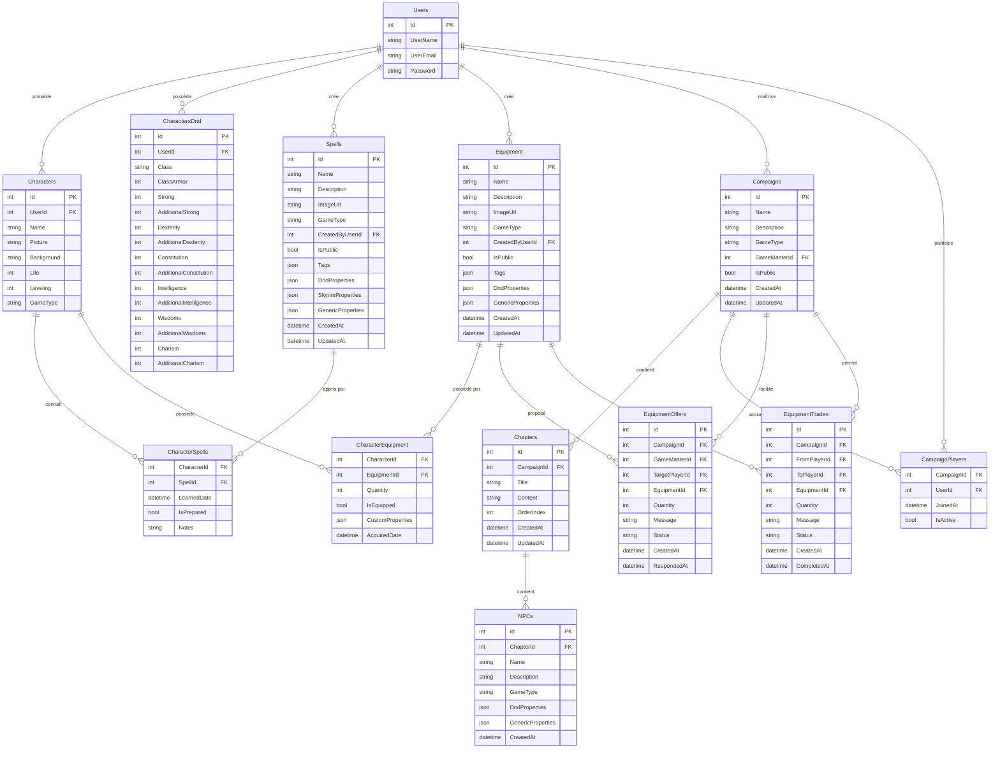

# Schéma de Base de Données - Chronique des Mondes

Ce document présente le schéma de base de données actuel et les évolutions prévues pour les systèmes de sorts et équipements.

## 📊 Vue d'ensemble

### État Actuel vs Prévu



## 🏗️ Détail des Tables

### Tables Actuellement Implémentées ✅

#### **Users**
```sql
CREATE TABLE Users (
    Id int IDENTITY(1,1) PRIMARY KEY,
    UserName nvarchar(20) NOT NULL,
    UserEmail nvarchar(255) NOT NULL,
    Password nvarchar(255) NOT NULL,
    
    CONSTRAINT UQ_Users_UserEmail UNIQUE (UserEmail)
);
```

#### **Characters (Abstrait)**
```sql
-- Note: Cette table existe conceptuellement via l'héritage EF
-- Les propriétés communes sont dans les tables dérivées
```

#### **CharactersDnd**
```sql
CREATE TABLE CharactersDnd (
    Id int IDENTITY(1,1) PRIMARY KEY,
    UserId int NOT NULL,
    Name nvarchar(100) NOT NULL,
    Picture nvarchar(255),
    Background nvarchar(max),
    Life int NOT NULL DEFAULT 0,
    Leveling int NOT NULL DEFAULT 1,
    
    -- Propriétés D&D spécifiques
    Class nvarchar(50) NOT NULL,
    ClassArmor int NOT NULL DEFAULT 10,
    Strong int NOT NULL DEFAULT 10,
    AdditionalStrong int NOT NULL DEFAULT 0,
    Dexterity int NOT NULL DEFAULT 10,
    AdditionalDexterity int NOT NULL DEFAULT 0,
    Constitution int NOT NULL DEFAULT 10,
    AdditionalConstitution int NOT NULL DEFAULT 0,
    Intelligence int NOT NULL DEFAULT 10,
    AdditionalIntelligence int NOT NULL DEFAULT 0,
    Wisdoms int NOT NULL DEFAULT 10,
    AdditionalWisdoms int NOT NULL DEFAULT 0,
    Charism int NOT NULL DEFAULT 10,
    AdditionalCharism int NOT NULL DEFAULT 0,
    
    CONSTRAINT FK_CharactersDnd_Users FOREIGN KEY (UserId) REFERENCES Users(Id)
);
```

### Nouvelles Tables à Créer 🚧

#### **Spells**
```sql
CREATE TABLE Spells (
    Id int IDENTITY(1,1) PRIMARY KEY,
    Name nvarchar(100) NOT NULL,
    Description nvarchar(max) NOT NULL,
    ImageUrl nvarchar(255),
    GameType nvarchar(20) NOT NULL DEFAULT 'generic',
    CreatedByUserId int NOT NULL, -- 0 = Administrateur
    IsPublic bit NOT NULL DEFAULT 0,
    Tags nvarchar(max), -- JSON array
    
    -- Propriétés spécialisées stockées en JSON
    DndProperties nvarchar(max), -- JSON pour propriétés D&D
    SkyrimProperties nvarchar(max), -- JSON pour propriétés Skyrim
    GenericProperties nvarchar(max), -- JSON pour propriétés génériques
    
    CreatedAt datetime2 NOT NULL DEFAULT GETDATE(),
    UpdatedAt datetime2 NOT NULL DEFAULT GETDATE(),
    
    CONSTRAINT FK_Spells_Users FOREIGN KEY (CreatedByUserId) REFERENCES Users(Id),
    CONSTRAINT CK_Spells_GameType CHECK (GameType IN ('generic', 'dnd', 'skyrim'))
);

-- Index pour optimiser les requêtes
CREATE INDEX IX_Spells_GameType_IsPublic ON Spells (GameType, IsPublic);
CREATE INDEX IX_Spells_CreatedByUserId ON Spells (CreatedByUserId);
```

**Exemple de DndProperties JSON :**
```json
{
  "level": 3,
  "school": "Évocation",
  "castingTime": "1 action",
  "range": "45 mètres",
  "duration": "Instantané",
  "components": ["V", "S", "M"],
  "damageFormula": "8d6",
  "requiresAttackRoll": false,
  "requiresSavingThrow": true,
  "savingThrowAbility": "Dextérité"
}
```

#### **Equipment**
```sql
CREATE TABLE Equipment (
    Id int IDENTITY(1,1) PRIMARY KEY,
    Name nvarchar(100) NOT NULL,
    Description nvarchar(max) NOT NULL,
    ImageUrl nvarchar(255),
    GameType nvarchar(20) NOT NULL DEFAULT 'generic',
    CreatedByUserId int NOT NULL, -- 0 = Administrateur
    IsPublic bit NOT NULL DEFAULT 0,
    Tags nvarchar(max), -- JSON array
    
    -- Propriétés spécialisées stockées en JSON
    DndProperties nvarchar(max), -- JSON pour propriétés D&D
    GenericProperties nvarchar(max), -- JSON pour propriétés génériques
    
    CreatedAt datetime2 NOT NULL DEFAULT GETDATE(),
    UpdatedAt datetime2 NOT NULL DEFAULT GETDATE(),
    
    CONSTRAINT FK_Equipment_Users FOREIGN KEY (CreatedByUserId) REFERENCES Users(Id),
    CONSTRAINT CK_Equipment_GameType CHECK (GameType IN ('generic', 'dnd', 'skyrim'))
);

-- Index pour optimiser les requêtes
CREATE INDEX IX_Equipment_GameType_IsPublic ON Equipment (GameType, IsPublic);
CREATE INDEX IX_Equipment_CreatedByUserId ON Equipment (CreatedByUserId);
```

**Exemple de DndProperties JSON :**
```json
{
  "equipmentType": "Weapon",
  "weaponCategory": "Martial",
  "damageFormula": "1d8 + mod",
  "damageType": "Tranchant",
  "properties": ["Versatile (1d10)", "Finesse"],
  "rarity": "Commun",
  "requiresAttunement": false,
  "armorClassBase": null,
  "armorClassDexBonus": null
}
```

#### **Campaigns**
```sql
CREATE TABLE Campaigns (
    Id int IDENTITY(1,1) PRIMARY KEY,
    Name nvarchar(100) NOT NULL,
    Description nvarchar(max),
    GameType nvarchar(20) NOT NULL DEFAULT 'generic',
    GameMasterId int NOT NULL,
    IsPublic bit NOT NULL DEFAULT 0,
    
    CreatedAt datetime2 NOT NULL DEFAULT GETDATE(),
    UpdatedAt datetime2 NOT NULL DEFAULT GETDATE(),
    
    CONSTRAINT FK_Campaigns_GameMaster FOREIGN KEY (GameMasterId) REFERENCES Users(Id),
    CONSTRAINT CK_Campaigns_GameType CHECK (GameType IN ('generic', 'dnd', 'skyrim'))
);
```

#### **CharacterSpells (Table de liaison)**
```sql
CREATE TABLE CharacterSpells (
    CharacterId int NOT NULL,
    SpellId int NOT NULL,
    LearnedDate datetime2 NOT NULL DEFAULT GETDATE(),
    IsPrepared bit NOT NULL DEFAULT 1,
    Notes nvarchar(500),
    
    CONSTRAINT PK_CharacterSpells PRIMARY KEY (CharacterId, SpellId),
    CONSTRAINT FK_CharacterSpells_Character FOREIGN KEY (CharacterId) REFERENCES CharactersDnd(Id),
    CONSTRAINT FK_CharacterSpells_Spell FOREIGN KEY (SpellId) REFERENCES Spells(Id)
);
```

#### **CharacterEquipment (Table de liaison)**
```sql
CREATE TABLE CharacterEquipment (
    CharacterId int NOT NULL,
    EquipmentId int NOT NULL,
    Quantity int NOT NULL DEFAULT 1,
    IsEquipped bit NOT NULL DEFAULT 0,
    CustomProperties nvarchar(max), -- JSON pour propriétés custom
    AcquiredDate datetime2 NOT NULL DEFAULT GETDATE(),
    
    CONSTRAINT PK_CharacterEquipment PRIMARY KEY (CharacterId, EquipmentId),
    CONSTRAINT FK_CharacterEquipment_Character FOREIGN KEY (CharacterId) REFERENCES CharactersDnd(Id),
    CONSTRAINT FK_CharacterEquipment_Equipment FOREIGN KEY (EquipmentId) REFERENCES Equipment(Id),
    CONSTRAINT CK_CharacterEquipment_Quantity CHECK (Quantity > 0)
);
```

#### **EquipmentOffers (Propositions MJ → Joueur)**
```sql
CREATE TABLE EquipmentOffers (
    Id int IDENTITY(1,1) PRIMARY KEY,
    CampaignId int NOT NULL,
    GameMasterId int NOT NULL,
    TargetPlayerId int NOT NULL,
    EquipmentId int NOT NULL,
    Quantity int NOT NULL DEFAULT 1,
    Message nvarchar(500),
    Status nvarchar(20) NOT NULL DEFAULT 'Pending',
    
    CreatedAt datetime2 NOT NULL DEFAULT GETDATE(),
    RespondedAt datetime2,
    
    CONSTRAINT FK_EquipmentOffers_Campaign FOREIGN KEY (CampaignId) REFERENCES Campaigns(Id),
    CONSTRAINT FK_EquipmentOffers_GameMaster FOREIGN KEY (GameMasterId) REFERENCES Users(Id),
    CONSTRAINT FK_EquipmentOffers_TargetPlayer FOREIGN KEY (TargetPlayerId) REFERENCES Users(Id),
    CONSTRAINT FK_EquipmentOffers_Equipment FOREIGN KEY (EquipmentId) REFERENCES Equipment(Id),
    CONSTRAINT CK_EquipmentOffers_Status CHECK (Status IN ('Pending', 'Accepted', 'Declined', 'Cancelled'))
);
```

#### **EquipmentTrades (Échanges Joueur → Joueur)**
```sql
CREATE TABLE EquipmentTrades (
    Id int IDENTITY(1,1) PRIMARY KEY,
    CampaignId int NOT NULL,
    FromPlayerId int NOT NULL,
    ToPlayerId int NOT NULL,
    EquipmentId int NOT NULL,
    Quantity int NOT NULL DEFAULT 1,
    Message nvarchar(500),
    Status nvarchar(20) NOT NULL DEFAULT 'Proposed',
    
    CreatedAt datetime2 NOT NULL DEFAULT GETDATE(),
    CompletedAt datetime2,
    
    CONSTRAINT FK_EquipmentTrades_Campaign FOREIGN KEY (CampaignId) REFERENCES Campaigns(Id),
    CONSTRAINT FK_EquipmentTrades_FromPlayer FOREIGN KEY (FromPlayerId) REFERENCES Users(Id),
    CONSTRAINT FK_EquipmentTrades_ToPlayer FOREIGN KEY (ToPlayerId) REFERENCES Users(Id),
    CONSTRAINT FK_EquipmentTrades_Equipment FOREIGN KEY (EquipmentId) REFERENCES Equipment(Id),
    CONSTRAINT CK_EquipmentTrades_Status CHECK (Status IN ('Proposed', 'Accepted', 'Declined', 'Completed', 'Cancelled')),
    CONSTRAINT CK_EquipmentTrades_DifferentPlayers CHECK (FromPlayerId != ToPlayerId)
);
```

## 🔄 Migrations Prévues

### Migration 1 : Tables de Base
```bash
dotnet ef migrations add CreateSpellsAndEquipmentTables
```
- Création des tables `Spells` et `Equipment`
- Index pour optimisation des requêtes

### Migration 2 : Système d'Apprentissage
```bash
dotnet ef migrations add CreateCharacterSpellsRelation
```
- Création de la table `CharacterSpells`
- Relations avec validation

### Migration 3 : Système d'Inventaire
```bash
dotnet ef migrations add CreateCharacterEquipmentRelation
```
- Création de la table `CharacterEquipment`
- Support des quantités multiples

### Migration 4 : Système d'Échanges
```bash
dotnet ef migrations add CreateEquipmentExchangeSystem
```
- Création des tables `EquipmentOffers` et `EquipmentTrades`
- Contraintes de validation des échanges

### Migration 5 : Campagnes et Chapitres
```bash
dotnet ef migrations add CreateCampaignsAndChapters
```
- Système complet de gestion des campagnes
- Tables `Campaigns`, `Chapters`, `NPCs`, `CampaignPlayers`

## 📈 Données de Test

### Scripts d'Injection Administrative

#### **Sorts D&D Officiels**
```sql
-- Sorts de niveau 1
INSERT INTO Spells (Name, Description, GameType, CreatedByUserId, IsPublic, DndProperties)
VALUES 
('Projectile Magique', 'Trois projectiles d''énergie pure frappent automatiquement leurs cibles.', 'dnd', 0, 1, 
 '{"level":1,"school":"Évocation","castingTime":"1 action","range":"36 mètres","duration":"Instantané","components":["V","S"],"damageFormula":"1d4+1","requiresAttackRoll":true}'),

('Soin', 'Restaure instantanément les points de vie de la cible.', 'dnd', 0, 1,
 '{"level":1,"school":"Évocation","castingTime":"1 action","range":"Contact","duration":"Instantané","components":["V","S"],"damageFormula":"1d8+mod","requiresAttackRoll":false}');

-- Sorts de niveau 3
INSERT INTO Spells (Name, Description, GameType, CreatedByUserId, IsPublic, DndProperties)
VALUES 
('Boule de Feu', 'Une explosion de flammes dévastatrice dans une zone de 6 mètres de rayon.', 'dnd', 0, 1,
 '{"level":3,"school":"Évocation","castingTime":"1 action","range":"45 mètres","duration":"Instantané","components":["V","S","M"],"damageFormula":"8d6","requiresSavingThrow":true,"savingThrowAbility":"Dextérité"}');
```

#### **Équipements D&D Officiels**
```sql
-- Armes
INSERT INTO Equipment (Name, Description, GameType, CreatedByUserId, IsPublic, DndProperties)
VALUES 
('Épée Longue', 'Arme martiale polyvalente à une main.', 'dnd', 0, 1,
 '{"equipmentType":"Weapon","weaponCategory":"Martial","damageFormula":"1d8","damageType":"Tranchant","properties":["Versatile (1d10)"],"rarity":"Commun"}'),

('Dague', 'Arme simple légère et précise.', 'dnd', 0, 1,
 '{"equipmentType":"Weapon","weaponCategory":"Simple","damageFormula":"1d4","damageType":"Perforant","properties":["Finesse","Light","Thrown (6/18)"],"rarity":"Commun"}');

-- Armures
INSERT INTO Equipment (Name, Description, GameType, CreatedByUserId, IsPublic, DndProperties)
VALUES 
('Armure de Cuir', 'Armure légère flexible et silencieuse.', 'dnd', 0, 1,
 '{"equipmentType":"Armor","armorCategory":"Light","armorClassBase":11,"armorClassDexBonus":10,"rarity":"Commun"}'),

('Cotte de Mailles', 'Armure intermédiaire offrant une bonne protection.', 'dnd', 0, 1,
 '{"equipmentType":"Armor","armorCategory":"Medium","armorClassBase":13,"armorClassDexBonus":2,"rarity":"Commun"}');

-- Consommables
INSERT INTO Equipment (Name, Description, GameType, CreatedByUserId, IsPublic, DndProperties)
VALUES 
('Potion de Soins', 'Récupère des points de vie instantanément.', 'dnd', 0, 1,
 '{"equipmentType":"Consumable","properties":["Healing 2d4+2"],"rarity":"Commun"}');
```

## 🎯 Optimisations Prévues

### Index de Performance
```sql
-- Optimisation des requêtes fréquentes
CREATE INDEX IX_Spells_GameType_Public ON Spells (GameType, IsPublic) INCLUDE (Name, CreatedByUserId);
CREATE INDEX IX_Equipment_GameType_Public ON Equipment (GameType, IsPublic) INCLUDE (Name, CreatedByUserId);
CREATE INDEX IX_CharacterSpells_Character ON CharacterSpells (CharacterId) INCLUDE (SpellId, IsPrepared);
CREATE INDEX IX_CharacterEquipment_Character ON CharacterEquipment (CharacterId) INCLUDE (EquipmentId, Quantity, IsEquipped);
```

### Vues Métier
```sql
-- Vue pour les sorts disponibles par utilisateur
CREATE VIEW v_AvailableSpells AS
SELECT s.*, 
       CASE WHEN s.CreatedByUserId = 0 THEN 'Official' ELSE 'Private' END AS Source,
       u.UserName AS CreatedByUserName
FROM Spells s
LEFT JOIN Users u ON s.CreatedByUserId = u.Id
WHERE s.IsPublic = 1 OR s.CreatedByUserId = @UserId;

-- Vue pour l'inventaire complet des personnages
CREATE VIEW v_CharacterInventory AS
SELECT ce.CharacterId, ce.EquipmentId, ce.Quantity, ce.IsEquipped,
       e.Name, e.Description, e.GameType, e.DndProperties,
       CASE WHEN e.CreatedByUserId = 0 THEN 'Official' ELSE 'Private' END AS Source
FROM CharacterEquipment ce
INNER JOIN Equipment e ON ce.EquipmentId = e.Id;
```

---

*Ce schéma évoluera au fur et à mesure du développement. Retour au [README principal](./README.md)*