# Schéma de Base de Données - Chronique des Mondes

Ce document présente le schéma de base de données actuel et les évolutions prévues pour les systèmes de sorts et équipements.

## 📊 Vue d'ensemble

### État Actuel vs Prévu


## 🏗️ Détail des Tables

### Tables Actuellement Implémentées ✅

#### **Users**
```sql
CREATE TABLE Users (
    Id int IDENTITY(1,1) PRIMARY KEY,
    UserName nvarchar(20) NOT NULL,
    UserEmail nvarchar(255) NOT NULL,
    Password nvarchar(255) NOT NULL,
    
    CONSTRAINT UQ_Users_UserEmail UNIQUE (UserEmail)
);
```

#### **Characters (Abstrait)**
```sql
-- Note: Cette table existe conceptuellement via l'héritage EF
-- Les propriétés communes sont dans les tables dérivées
```

#### **CharactersDnd**
```sql
CREATE TABLE CharactersDnd (
    Id int IDENTITY(1,1) PRIMARY KEY,
    UserId int NOT NULL,
    Name nvarchar(100) NOT NULL,
    Picture nvarchar(255),
    Background nvarchar(max),
    Life int NOT NULL DEFAULT 0,
    Leveling int NOT NULL DEFAULT 1,
    
    -- Propriétés D&D spécifiques
    Class nvarchar(50) NOT NULL,
    ClassArmor int NOT NULL DEFAULT 10,
    Strong int NOT NULL DEFAULT 10,
    AdditionalStrong int NOT NULL DEFAULT 0,
    Dexterity int NOT NULL DEFAULT 10,
    AdditionalDexterity int NOT NULL DEFAULT 0,
    Constitution int NOT NULL DEFAULT 10,
    AdditionalConstitution int NOT NULL DEFAULT 0,
    Intelligence int NOT NULL DEFAULT 10,
    AdditionalIntelligence int NOT NULL DEFAULT 0,
    Wisdoms int NOT NULL DEFAULT 10,
    AdditionalWisdoms int NOT NULL DEFAULT 0,
    Charism int NOT NULL DEFAULT 10,
    AdditionalCharism int NOT NULL DEFAULT 0,
    
    CONSTRAINT FK_CharactersDnd_Users FOREIGN KEY (UserId) REFERENCES Users(Id)
);
```

### Nouvelles Tables à Créer 🚧

#### **Spells**
```sql
CREATE TABLE Spells (
    Id int IDENTITY(1,1) PRIMARY KEY,
    Name nvarchar(100) NOT NULL,
    Description nvarchar(max) NOT NULL,
    ImageUrl nvarchar(255),
    GameType nvarchar(20) NOT NULL DEFAULT 'generic',
    CreatedByUserId int NOT NULL, -- 0 = Administrateur
    IsPublic bit NOT NULL DEFAULT 0,
    Tags nvarchar(max), -- JSON array
    
    -- Propriétés spécialisées stockées en JSON
    DndProperties nvarchar(max), -- JSON pour propriétés D&D
    SkyrimProperties nvarchar(max), -- JSON pour propriétés Skyrim
    GenericProperties nvarchar(max), -- JSON pour propriétés génériques
    
    CreatedAt datetime2 NOT NULL DEFAULT GETDATE(),
    UpdatedAt datetime2 NOT NULL DEFAULT GETDATE(),
    
    CONSTRAINT FK_Spells_Users FOREIGN KEY (CreatedByUserId) REFERENCES Users(Id),
    CONSTRAINT CK_Spells_GameType CHECK (GameType IN ('generic', 'dnd', 'skyrim'))
);

-- Index pour optimiser les requêtes
CREATE INDEX IX_Spells_GameType_IsPublic ON Spells (GameType, IsPublic);
CREATE INDEX IX_Spells_CreatedByUserId ON Spells (CreatedByUserId);
```

**Exemple de DndProperties JSON :**
```json
{
  "level": 3,
  "school": "Évocation",
  "castingTime": "1 action",
  "range": "45 mètres",
  "duration": "Instantané",
  "components": ["V", "S", "M"],
  "damageFormula": "8d6",
  "requiresAttackRoll": false,
  "requiresSavingThrow": true,
  "savingThrowAbility": "Dextérité"
}
```

#### **Equipment**
```sql
CREATE TABLE Equipment (
    Id int IDENTITY(1,1) PRIMARY KEY,
    Name nvarchar(100) NOT NULL,
    Description nvarchar(max) NOT NULL,
    ImageUrl nvarchar(255),
    GameType nvarchar(20) NOT NULL DEFAULT 'generic',
    CreatedByUserId int NOT NULL, -- 0 = Administrateur
    IsPublic bit NOT NULL DEFAULT 0,
    Tags nvarchar(max), -- JSON array
    
    -- Propriétés spécialisées stockées en JSON
    DndProperties nvarchar(max), -- JSON pour propriétés D&D
    GenericProperties nvarchar(max), -- JSON pour propriétés génériques
    
    CreatedAt datetime2 NOT NULL DEFAULT GETDATE(),
    UpdatedAt datetime2 NOT NULL DEFAULT GETDATE(),
    
    CONSTRAINT FK_Equipment_Users FOREIGN KEY (CreatedByUserId) REFERENCES Users(Id),
    CONSTRAINT CK_Equipment_GameType CHECK (GameType IN ('generic', 'dnd', 'skyrim'))
);

-- Index pour optimiser les requêtes
CREATE INDEX IX_Equipment_GameType_IsPublic ON Equipment (GameType, IsPublic);
CREATE INDEX IX_Equipment_CreatedByUserId ON Equipment (CreatedByUserId);
```

**Exemple de DndProperties JSON :**
```json
{
  "equipmentType": "Weapon",
  "weaponCategory": "Martial",
  "damageFormula": "1d8 + mod",
  "damageType": "Tranchant",
  "properties": ["Versatile (1d10)", "Finesse"],
  "rarity": "Commun",
  "requiresAttunement": false,
  "armorClassBase": null,
  "armorClassDexBonus": null
}
```

#### **Campaigns**
```sql
CREATE TABLE Campaigns (
    Id int IDENTITY(1,1) PRIMARY KEY,
    Name nvarchar(100) NOT NULL,
    Description nvarchar(max),
    GameType nvarchar(20) NOT NULL DEFAULT 'generic',
    GameMasterId int NOT NULL,
    IsPublic bit NOT NULL DEFAULT 0,
    CurrentChapterId int,
    
    CreatedAt datetime2 NOT NULL DEFAULT GETDATE(),
    UpdatedAt datetime2 NOT NULL DEFAULT GETDATE(),
    
    CONSTRAINT FK_Campaigns_GameMaster FOREIGN KEY (GameMasterId) REFERENCES Users(Id),
    CONSTRAINT CK_Campaigns_GameType CHECK (GameType IN ('generic', 'dnd', 'skyrim'))
);
```

#### **Chapters**
```sql
CREATE TABLE Chapters (
    Id int IDENTITY(1,1) PRIMARY KEY,
    CampaignId int NOT NULL,
    ChapterNumber int NOT NULL,
    Title nvarchar(100) NOT NULL,
    Content nvarchar(max),
    OrderIndex int,
    Status nvarchar(20) NOT NULL DEFAULT 'Pending',
    
    CreatedAt datetime2 NOT NULL DEFAULT GETDATE(),
    UpdatedAt datetime2 NOT NULL DEFAULT GETDATE(),
    
    CONSTRAINT FK_Chapters_Campaigns FOREIGN KEY (CampaignId) REFERENCES Campaigns(Id),
    CONSTRAINT CK_Chapters_Status CHECK (Status IN ('Pending', 'Active', 'Completed')),
    CONSTRAINT UQ_Chapters_CampaignId_ChapterNumber UNIQUE (CampaignId, ChapterNumber)
);
```

#### **CharacterSpells (Table de liaison)**
```sql
CREATE TABLE CharacterSpells (
    CharacterId int NOT NULL,
    SpellId int NOT NULL,
    LearnedDate datetime2 NOT NULL DEFAULT GETDATE(),
    IsPrepared bit NOT NULL DEFAULT 1,
    Notes nvarchar(500),
    
    CONSTRAINT PK_CharacterSpells PRIMARY KEY (CharacterId, SpellId),
    CONSTRAINT FK_CharacterSpells_Character FOREIGN KEY (CharacterId) REFERENCES CharactersDnd(Id),
    CONSTRAINT FK_CharacterSpells_Spell FOREIGN KEY (SpellId) REFERENCES Spells(Id)
);
```

#### **CharacterEquipment (Table de liaison)**
```sql
CREATE TABLE CharacterEquipment (
    CharacterId int NOT NULL,
    EquipmentId int NOT NULL,
    Quantity int NOT NULL DEFAULT 1,
    IsEquipped bit NOT NULL DEFAULT 0,
    CustomProperties nvarchar(max), -- JSON pour propriétés custom
    AcquiredDate datetime2 NOT NULL DEFAULT GETDATE(),
    
    CONSTRAINT PK_CharacterEquipment PRIMARY KEY (CharacterId, EquipmentId),
    CONSTRAINT FK_CharacterEquipment_Character FOREIGN KEY (CharacterId) REFERENCES CharactersDnd(Id),
    CONSTRAINT FK_CharacterEquipment_Equipment FOREIGN KEY (EquipmentId) REFERENCES Equipment(Id),
    CONSTRAINT CK_CharacterEquipment_Quantity CHECK (Quantity > 0)
);
```

#### **EquipmentOffers (Propositions MJ → Joueur)**
```sql
CREATE TABLE EquipmentOffers (
    Id int IDENTITY(1,1) PRIMARY KEY,
    CampaignId int NOT NULL,
    GameMasterId int NOT NULL,
    TargetPlayerId int NOT NULL,
    EquipmentId int NOT NULL,
    Quantity int NOT NULL DEFAULT 1,
    Message nvarchar(500),
    Status nvarchar(20) NOT NULL DEFAULT 'Pending',
    
    CreatedAt datetime2 NOT NULL DEFAULT GETDATE(),
    RespondedAt datetime2,
    
    CONSTRAINT FK_EquipmentOffers_Campaign FOREIGN KEY (CampaignId) REFERENCES Campaigns(Id),
    CONSTRAINT FK_EquipmentOffers_GameMaster FOREIGN KEY (GameMasterId) REFERENCES Users(Id),
    CONSTRAINT FK_EquipmentOffers_TargetPlayer FOREIGN KEY (TargetPlayerId) REFERENCES Users(Id),
    CONSTRAINT FK_EquipmentOffers_Equipment FOREIGN KEY (EquipmentId) REFERENCES Equipment(Id),
    CONSTRAINT CK_EquipmentOffers_Status CHECK (Status IN ('Pending', 'Accepted', 'Declined', 'Cancelled'))
);
```

#### **EquipmentTrades (Échanges Joueur → Joueur)**
```sql
CREATE TABLE EquipmentTrades (
    Id int IDENTITY(1,1) PRIMARY KEY,
    CampaignId int NOT NULL,
    FromPlayerId int NOT NULL,
    ToPlayerId int NOT NULL,
    EquipmentId int NOT NULL,
    Quantity int NOT NULL DEFAULT 1,
    Message nvarchar(500),
    Status nvarchar(20) NOT NULL DEFAULT 'Proposed',
    
    CreatedAt datetime2 NOT NULL DEFAULT GETDATE(),
    CompletedAt datetime2,
    
    CONSTRAINT FK_EquipmentTrades_Campaign FOREIGN KEY (CampaignId) REFERENCES Campaigns(Id),
    CONSTRAINT FK_EquipmentTrades_FromPlayer FOREIGN KEY (FromPlayerId) REFERENCES Users(Id),
    CONSTRAINT FK_EquipmentTrades_ToPlayer FOREIGN KEY (ToPlayerId) REFERENCES Users(Id),
    CONSTRAINT FK_EquipmentTrades_Equipment FOREIGN KEY (EquipmentId) REFERENCES Equipment(Id),
    CONSTRAINT CK_EquipmentTrades_Status CHECK (Status IN ('Proposed', 'Accepted', 'Declined', 'Completed', 'Cancelled')),
    CONSTRAINT CK_EquipmentTrades_DifferentPlayers CHECK (FromPlayerId != ToPlayerId)
);
```

#### **Sessions (Gestion des Séances de Jeu)**
```sql
CREATE TABLE Sessions (
    SessionId nvarchar(50) PRIMARY KEY,  -- Format: sess_abc123
    CampaignId int NOT NULL,
    GameMasterId int NOT NULL,
    Status nvarchar(20) NOT NULL DEFAULT 'active',
    StartedAt datetime2 NOT NULL DEFAULT GETDATE(),
    EndedAt datetime2,
    CurrentChapterId int,
    SessionSettings nvarchar(max),  -- JSON: autosave, notifications, etc.
    LastSavedAt datetime2,
    
    CONSTRAINT FK_Sessions_Campaign FOREIGN KEY (CampaignId) REFERENCES Campaigns(Id),
    CONSTRAINT FK_Sessions_GameMaster FOREIGN KEY (GameMasterId) REFERENCES Users(Id),
    CONSTRAINT FK_Sessions_CurrentChapter FOREIGN KEY (CurrentChapterId) REFERENCES Chapters(Id),
    CONSTRAINT CK_Sessions_Status CHECK (Status IN ('active', 'paused', 'ended', 'waiting'))
);

CREATE INDEX IX_Sessions_Campaign_Status ON Sessions (CampaignId, Status);
```

#### **SessionParticipants (Participants aux Sessions)**
```sql
CREATE TABLE SessionParticipants (
    SessionId nvarchar(50) NOT NULL,
    UserId int NOT NULL,
    CharacterId int NOT NULL,
    Status nvarchar(20) NOT NULL DEFAULT 'invited',
    JoinedAt datetime2,
    LastSeenAt datetime2,
    IsOnline bit NOT NULL DEFAULT 0,
    
    CONSTRAINT PK_SessionParticipants PRIMARY KEY (SessionId, UserId),
    CONSTRAINT FK_SessionParticipants_Session FOREIGN KEY (SessionId) REFERENCES Sessions(SessionId),
    CONSTRAINT FK_SessionParticipants_User FOREIGN KEY (UserId) REFERENCES Users(Id),
    CONSTRAINT FK_SessionParticipants_Character FOREIGN KEY (CharacterId) REFERENCES CharactersDnd(Id),
    CONSTRAINT CK_SessionParticipants_Status CHECK (Status IN ('invited', 'joined', 'declined', 'disconnected'))
);
```

#### **CampaignInvitations (Invitations aux Campagnes)**
```sql
CREATE TABLE CampaignInvitations (
    Id int IDENTITY(1,1) PRIMARY KEY,
    CampaignId int NOT NULL,
    InviterId int NOT NULL,
    InviteeEmail nvarchar(255),
    InviteeUserId int,  -- Si utilisateur existant
    Status nvarchar(20) NOT NULL DEFAULT 'pending',
    Message nvarchar(500),
    CreatedAt datetime2 NOT NULL DEFAULT GETDATE(),
    ExpiresAt datetime2 NOT NULL,
    RespondedAt datetime2,
    
    CONSTRAINT FK_CampaignInvitations_Campaign FOREIGN KEY (CampaignId) REFERENCES Campaigns(Id),
    CONSTRAINT FK_CampaignInvitations_Inviter FOREIGN KEY (InviterId) REFERENCES Users(Id),
    CONSTRAINT FK_CampaignInvitations_Invitee FOREIGN KEY (InviteeUserId) REFERENCES Users(Id),
    CONSTRAINT CK_CampaignInvitations_Status CHECK (Status IN ('pending', 'accepted', 'declined', 'expired')),
    CONSTRAINT CK_CampaignInvitations_Contact CHECK (InviteeEmail IS NOT NULL OR InviteeUserId IS NOT NULL)
);
```

#### **CampaignProgress (Progression des Campagnes)**
```sql
CREATE TABLE CampaignProgress (
    CampaignId int NOT NULL,
    UserId int NOT NULL,
    CurrentChapterId int,
    CompletedChapters int NOT NULL DEFAULT 0,
    TotalChapters int NOT NULL DEFAULT 0,
    ProgressPercentage decimal(5,2) NOT NULL DEFAULT 0.00,
    LastUpdated datetime2 NOT NULL DEFAULT GETDATE(),
    
    CONSTRAINT PK_CampaignProgress PRIMARY KEY (CampaignId, UserId),
    CONSTRAINT FK_CampaignProgress_Campaign FOREIGN KEY (CampaignId) REFERENCES Campaigns(Id),
    CONSTRAINT FK_CampaignProgress_User FOREIGN KEY (UserId) REFERENCES Users(Id),
    CONSTRAINT FK_CampaignProgress_CurrentChapter FOREIGN KEY (CurrentChapterId) REFERENCES Chapters(Id),
    CONSTRAINT CK_CampaignProgress_Percentage CHECK (ProgressPercentage >= 0 AND ProgressPercentage <= 100)
);
```

#### **SessionSaves (Sauvegardes de Session)**
```sql
CREATE TABLE SessionSaves (
    Id int IDENTITY(1,1) PRIMARY KEY,
    SessionId nvarchar(50) NOT NULL,
    SaveSlot int NOT NULL,
    GameState nvarchar(max) NOT NULL,  -- JSON complet de l'état
    ChapterId int NOT NULL,
    Description nvarchar(200),
    CreatedAt datetime2 NOT NULL DEFAULT GETDATE(),
    
    CONSTRAINT FK_SessionSaves_Session FOREIGN KEY (SessionId) REFERENCES Sessions(SessionId),
    CONSTRAINT FK_SessionSaves_Chapter FOREIGN KEY (ChapterId) REFERENCES Chapters(Id),
    CONSTRAINT UQ_SessionSaves_Slot UNIQUE (SessionId, SaveSlot),
    CONSTRAINT CK_SessionSaves_Slot CHECK (SaveSlot >= 1 AND SaveSlot <= 10)
);
```

#### **Combats (Sessions de Combat)**
```sql
CREATE TABLE Combats (
    Id int IDENTITY(1,1) PRIMARY KEY,
    SessionId nvarchar(50) NOT NULL,
    ChapterId int NOT NULL,
    Status nvarchar(20) NOT NULL DEFAULT 'initiative',
    CurrentTurn int NOT NULL DEFAULT 1,
    TurnOrder nvarchar(max),  -- JSON ordre des tours
    StartedAt datetime2 NOT NULL DEFAULT GETDATE(),
    EndedAt datetime2,
    
    CONSTRAINT FK_Combats_Session FOREIGN KEY (SessionId) REFERENCES Sessions(SessionId),
    CONSTRAINT FK_Combats_Chapter FOREIGN KEY (ChapterId) REFERENCES Chapters(Id),
    CONSTRAINT CK_Combats_Status CHECK (Status IN ('initiative', 'active', 'paused', 'ended'))
);
```

#### **CombatParticipants (Participants aux Combats)**
```sql
CREATE TABLE CombatParticipants (
    CombatId int NOT NULL,
    ParticipantId int NOT NULL,
    ParticipantType nvarchar(10) NOT NULL,
    CharacterId int,  -- Si joueur
    NpcId int,        -- Si PNJ/monstre
    Initiative int NOT NULL,
    CurrentHitPoints int NOT NULL,
    MaxHitPoints int NOT NULL,
    StatusEffects nvarchar(max),  -- JSON effets actifs
    IsActive bit NOT NULL DEFAULT 1,
    
    CONSTRAINT PK_CombatParticipants PRIMARY KEY (CombatId, ParticipantId),
    CONSTRAINT FK_CombatParticipants_Combat FOREIGN KEY (CombatId) REFERENCES Combats(Id),
    CONSTRAINT FK_CombatParticipants_Character FOREIGN KEY (CharacterId) REFERENCES CharactersDnd(Id),
    CONSTRAINT FK_CombatParticipants_Npc FOREIGN KEY (NpcId) REFERENCES NPCs(Id),
    CONSTRAINT CK_CombatParticipants_Type CHECK (ParticipantType IN ('player', 'npc')),
    CONSTRAINT CK_CombatParticipants_Reference CHECK (
        (ParticipantType = 'player' AND CharacterId IS NOT NULL AND NpcId IS NULL) OR
        (ParticipantType = 'npc' AND CharacterId IS NULL AND NpcId IS NOT NULL)
    )
);
```

#### **Notifications (Système de Notifications)**
```sql
CREATE TABLE Notifications (
    Id int IDENTITY(1,1) PRIMARY KEY,
    UserId int NOT NULL,
    Type nvarchar(50) NOT NULL,
    Title nvarchar(100) NOT NULL,
    Message nvarchar(500) NOT NULL,
    Data nvarchar(max),  -- JSON données contextuelles
    IsRead bit NOT NULL DEFAULT 0,
    DeliveryMethod nvarchar(20) NOT NULL DEFAULT 'websocket',
    CreatedAt datetime2 NOT NULL DEFAULT GETDATE(),
    ReadAt datetime2,
    ExpiresAt datetime2,
    
    CONSTRAINT FK_Notifications_User FOREIGN KEY (UserId) REFERENCES Users(Id),
    CONSTRAINT CK_Notifications_Type CHECK (Type IN ('session_started', 'your_turn', 'combat_invite', 'campaign_invite', 'equipment_offer')),
    CONSTRAINT CK_Notifications_DeliveryMethod CHECK (DeliveryMethod IN ('websocket', 'email', 'both'))
);

-- Index pour les notifications non lues
CREATE INDEX IX_Notifications_User_Unread ON Notifications (UserId, IsRead, CreatedAt);
```

#### **PasswordResets (Réinitialisation Mots de Passe)**
```sql
CREATE TABLE PasswordResets (
    Id int IDENTITY(1,1) PRIMARY KEY,
    UserId int NOT NULL,
    ResetToken nvarchar(100) NOT NULL,
    CreatedAt datetime2 NOT NULL DEFAULT GETDATE(),
    ExpiresAt datetime2 NOT NULL,
    IsUsed bit NOT NULL DEFAULT 0,
    UsedAt datetime2,
    
    CONSTRAINT FK_PasswordResets_User FOREIGN KEY (UserId) REFERENCES Users(Id),
    CONSTRAINT UQ_PasswordResets_Token UNIQUE (ResetToken)
);

-- Index pour nettoyage automatique des tokens expirés
CREATE INDEX IX_PasswordResets_Expiry ON PasswordResets (ExpiresAt, IsUsed);
```

#### **PlayerStatistics (Statistiques Joueur)** ✨ NOUVEAU
```sql
CREATE TABLE PlayerStatistics (
    Id int IDENTITY(1,1) PRIMARY KEY,
    UserId int NOT NULL,
    StatType nvarchar(50) NOT NULL,
    StatCategory nvarchar(30) NOT NULL,
    StatValue decimal(18,2) NOT NULL,
    AdditionalData nvarchar(max),  -- JSON pour données contextuelles
    SessionId nvarchar(50),
    CharacterId int,
    CampaignId int,
    RecordedAt datetime2 NOT NULL DEFAULT GETDATE(),
    
    CONSTRAINT FK_PlayerStatistics_User FOREIGN KEY (UserId) REFERENCES Users(Id),
    CONSTRAINT FK_PlayerStatistics_Session FOREIGN KEY (SessionId) REFERENCES Sessions(SessionId),
    CONSTRAINT FK_PlayerStatistics_Character FOREIGN KEY (CharacterId) REFERENCES CharactersDnd(Id),
    CONSTRAINT FK_PlayerStatistics_Campaign FOREIGN KEY (CampaignId) REFERENCES Campaigns(Id),
    CONSTRAINT CK_PlayerStatistics_Category CHECK (StatCategory IN ('session', 'combat', 'dice', 'social', 'progression'))
);

-- Index pour requêtes de stats par utilisateur et type
CREATE INDEX IX_PlayerStatistics_User_Type ON PlayerStatistics (UserId, StatType, RecordedAt);
CREATE INDEX IX_PlayerStatistics_Character ON PlayerStatistics (CharacterId, StatCategory);
```

#### **DiceRolls (Historique des Jets de Dés)**
```sql
CREATE TABLE DiceRolls (
    Id int IDENTITY(1,1) PRIMARY KEY,
    UserId int NOT NULL,
    SessionId nvarchar(50),
    CharacterId int,
    DiceType nvarchar(10) NOT NULL,  -- d20, d6, d8, d12, etc.
    Result int NOT NULL,
    Context nvarchar(50),  -- attack, save, skill, spell, etc.
    TargetDC int,  -- Classe de difficulté visée
    IsSuccess bit,
    IsCritical bit NOT NULL DEFAULT 0,
    AdditionalModifiers int DEFAULT 0,
    RolledAt datetime2 NOT NULL DEFAULT GETDATE(),
    
    CONSTRAINT FK_DiceRolls_User FOREIGN KEY (UserId) REFERENCES Users(Id),
    CONSTRAINT FK_DiceRolls_Session FOREIGN KEY (SessionId) REFERENCES Sessions(SessionId),
    CONSTRAINT FK_DiceRolls_Character FOREIGN KEY (CharacterId) REFERENCES CharactersDnd(Id),
    CONSTRAINT CK_DiceRolls_DiceType CHECK (DiceType IN ('d4', 'd6', 'd8', 'd10', 'd12', 'd20', 'd100')),
    CONSTRAINT CK_DiceRolls_Context CHECK (Context IN ('attack', 'damage', 'save', 'skill', 'spell', 'initiative', 'other'))
);

-- Index pour analyse statistique des dés
CREATE INDEX IX_DiceRolls_User_Type ON DiceRolls (UserId, DiceType, RolledAt);
CREATE INDEX IX_DiceRolls_Character_Context ON DiceRolls (CharacterId, Context, RolledAt);
```

#### **Achievements (Système de Succès)**
```sql
CREATE TABLE Achievements (
    Id nvarchar(50) PRIMARY KEY,  -- Format: dragon_slayer, critical_master
    Name nvarchar(100) NOT NULL,
    Description nvarchar(500) NOT NULL,
    Icon nvarchar(10) NOT NULL,
    Category nvarchar(30) NOT NULL,
    Rarity nvarchar(20) NOT NULL,
    RequiredValue int,
    RequiredData nvarchar(max),  -- JSON critères complexes
    IsActive bit NOT NULL DEFAULT 1,
    CreatedAt datetime2 NOT NULL DEFAULT GETDATE(),
    
    CONSTRAINT CK_Achievements_Category CHECK (Category IN ('combat', 'exploration', 'social', 'mastery', 'collection', 'luck', 'progression')),
    CONSTRAINT CK_Achievements_Rarity CHECK (Rarity IN ('common', 'uncommon', 'rare', 'epic', 'legendary'))
);
```

#### **PlayerAchievements (Succès des Joueurs)**
```sql
CREATE TABLE PlayerAchievements (
    UserId int NOT NULL,
    AchievementId nvarchar(50) NOT NULL,
    Progress decimal(5,2) NOT NULL DEFAULT 0.00,
    CurrentValue int NOT NULL DEFAULT 0,
    IsUnlocked bit NOT NULL DEFAULT 0,
    UnlockedAt datetime2,
    UnlockedWithCharacterId int,
    UnlockContext nvarchar(max),  -- JSON circonstances du déblocage
    
    CONSTRAINT PK_PlayerAchievements PRIMARY KEY (UserId, AchievementId),
    CONSTRAINT FK_PlayerAchievements_User FOREIGN KEY (UserId) REFERENCES Users(Id),
    CONSTRAINT FK_PlayerAchievements_Achievement FOREIGN KEY (AchievementId) REFERENCES Achievements(Id),
    CONSTRAINT FK_PlayerAchievements_Character FOREIGN KEY (UnlockedWithCharacterId) REFERENCES CharactersDnd(Id),
    CONSTRAINT CK_PlayerAchievements_Progress CHECK (Progress >= 0 AND Progress <= 100)
);

-- Index pour dashboard des succès
CREATE INDEX IX_PlayerAchievements_User_Unlocked ON PlayerAchievements (UserId, IsUnlocked, UnlockedAt);
```

#### **CombatActions (Actions de Combat)** 
```sql
CREATE TABLE CombatActions (
    Id int IDENTITY(1,1) PRIMARY KEY,
    CombatId int NOT NULL,
    UserId int NOT NULL,
    CharacterId int NOT NULL,
    ActionType nvarchar(30) NOT NULL,
    TargetType nvarchar(20),
    TargetId int,
    DamageDealt int DEFAULT 0,
    DamageTaken int DEFAULT 0,
    IsHit bit DEFAULT 1,
    IsCritical bit DEFAULT 0,
    SpellId int,
    EquipmentId int,
    RoundNumber int NOT NULL,
    ActionOrder int NOT NULL,
    ActionData nvarchar(max),  -- JSON données détaillées
    ExecutedAt datetime2 NOT NULL DEFAULT GETDATE(),
    
    CONSTRAINT FK_CombatActions_Combat FOREIGN KEY (CombatId) REFERENCES Combats(Id),
    CONSTRAINT FK_CombatActions_User FOREIGN KEY (UserId) REFERENCES Users(Id),
    CONSTRAINT FK_CombatActions_Character FOREIGN KEY (CharacterId) REFERENCES CharactersDnd(Id),
    CONSTRAINT FK_CombatActions_Spell FOREIGN KEY (SpellId) REFERENCES Spells(Id),
    CONSTRAINT FK_CombatActions_Equipment FOREIGN KEY (EquipmentId) REFERENCES Equipment(Id),
    CONSTRAINT CK_CombatActions_ActionType CHECK (ActionType IN ('attack', 'spell', 'move', 'dodge', 'help', 'hide', 'dash', 'ready')),
    CONSTRAINT CK_CombatActions_TargetType CHECK (TargetType IN ('player', 'npc', 'environment', 'self', 'area'))
);

-- Index pour analyse de performance combat
CREATE INDEX IX_CombatActions_User_Combat ON CombatActions (UserId, CombatId, RoundNumber);
```

#### **SessionActivities (Activités de Session)**
```sql
CREATE TABLE SessionActivities (
    Id int IDENTITY(1,1) PRIMARY KEY,
    SessionId nvarchar(50) NOT NULL,
    UserId int NOT NULL,
    ActivityType nvarchar(30) NOT NULL,
    ActivityData nvarchar(max),  -- JSON données spécifiques
    ExperienceGained int DEFAULT 0,
    ItemsGained nvarchar(max),  -- JSON liste objets
    ActivityTime datetime2 NOT NULL DEFAULT GETDATE(),
    
    CONSTRAINT FK_SessionActivities_Session FOREIGN KEY (SessionId) REFERENCES Sessions(SessionId),
    CONSTRAINT FK_SessionActivities_User FOREIGN KEY (UserId) REFERENCES Users(Id),
    CONSTRAINT CK_SessionActivities_Type CHECK (ActivityType IN ('quest_complete', 'boss_defeat', 'treasure_find', 'level_up', 'skill_use', 'social_encounter'))
);
```

#### **PlayerReports (Rapports Personnalisés)**
```sql
CREATE TABLE PlayerReports (
    Id int IDENTITY(1,1) PRIMARY KEY,
    UserId int NOT NULL,
    ReportType nvarchar(20) NOT NULL,
    ReportPeriod nvarchar(20) NOT NULL,  -- monthly, yearly, custom
    StartDate datetime2 NOT NULL,
    EndDate datetime2 NOT NULL,
    ReportData nvarchar(max) NOT NULL,  -- JSON rapport complet
    GeneratedAt datetime2 NOT NULL DEFAULT GETDATE(),
    
    CONSTRAINT FK_PlayerReports_User FOREIGN KEY (UserId) REFERENCES Users(Id),
    CONSTRAINT CK_PlayerReports_Type CHECK (ReportType IN ('performance', 'progression', 'social', 'achievements')),
    CONSTRAINT CK_PlayerReports_Period CHECK (ReportPeriod IN ('weekly', 'monthly', 'yearly', 'custom'))
);

-- Index pour récupération des rapports
CREATE INDEX IX_PlayerReports_User_Period ON PlayerReports (UserId, ReportType, StartDate DESC);
```

## 🔗 **Schéma Relationnel Complet**

### Diagramme des Relations Entre Tables

```mermaid
erDiagram
    %% ========================================
    %% TABLES PRINCIPALES ET LEURS RELATIONS
    %% ========================================
    
    Users {
        int Id PK
        string UserName
        string UserEmail
        string Password
    }
    
    CharactersDnd {
        int Id PK
        int UserId FK
        string Name
        string Picture
        string Background
        int Life
        int Leveling
        string Class
        int ClassArmor
        int Strong
        int AdditionalStrong
        int Dexterity
        int AdditionalDexterity
        int Constitution
        int AdditionalConstitution
        int Intelligence
        int AdditionalIntelligence
        int Wisdoms
        int AdditionalWisdoms
        int Charism
        int AdditionalCharism
    }
    
    Spells {
        int Id PK
        string Name
        string Description
        string ImageUrl
        string GameType
        int CreatedByUserId FK
        bool IsPublic
        json Tags
        json DndProperties
        json SkyrimProperties
        json GenericProperties
        datetime CreatedAt
        datetime UpdatedAt
    }
    
    Equipment {
        int Id PK
        string Name
        string Description
        string ImageUrl
        string GameType
        int CreatedByUserId FK
        bool IsPublic
        json Tags
        json DndProperties
        json GenericProperties
        datetime CreatedAt
        datetime UpdatedAt
    }
    
    Campaigns {
        int Id PK
        string Name
        string Description
        string GameType
        int GameMasterId FK
        bool IsPublic
        int CurrentChapterId FK
        datetime CreatedAt
        datetime UpdatedAt
    }
    
    Chapters {
        int Id PK
        int CampaignId FK
        int ChapterNumber
        string Title
        string Content
        int OrderIndex
        string Status
        datetime CreatedAt
        datetime UpdatedAt
    }
    
    NPCs {
        int Id PK
        int ChapterId FK
        string Name
        string Description
        string GameType
        json DndProperties
        json GenericProperties
        datetime CreatedAt
    }
    
    CampaignPlayers {
        int CampaignId FK
        int UserId FK
        string Status
        datetime JoinedAt
        datetime InvitedAt
        bool IsActive
    }
    
    Sessions {
        string SessionId PK
        int CampaignId FK
        int GameMasterId FK
        string Status
        datetime StartedAt
        datetime EndedAt
        int CurrentChapterId FK
        json SessionSettings
        datetime LastSavedAt
    }
    
    SessionParticipants {
        string SessionId FK
        int UserId FK
        int CharacterId FK
        string Status
        datetime JoinedAt
        datetime LastSeenAt
        bool IsOnline
    }
    
    Combats {
        int Id PK
        string SessionId FK
        int ChapterId FK
        string Status
        int CurrentTurn
        json TurnOrder
        datetime StartedAt
        datetime EndedAt
    }
    
    CombatParticipants {
        int CombatId FK
        int ParticipantId
        string ParticipantType
        int CharacterId FK
        int NpcId FK
        int Initiative
        int CurrentHitPoints
        json StatusEffects
        bool IsActive
    }
    
    CharacterSpells {
        int CharacterId FK
        int SpellId FK
        datetime LearnedDate
        bool IsPrepared
        string Notes
    }
    
    CharacterEquipment {
        int CharacterId FK
        int EquipmentId FK
        int Quantity
        bool IsEquipped
        json CustomProperties
        datetime AcquiredDate
    }
    
    EquipmentOffers {
        int Id PK
        int CampaignId FK
        int GameMasterId FK
        int TargetPlayerId FK
        int EquipmentId FK
        int Quantity
        string Message
        string Status
        datetime CreatedAt
        datetime RespondedAt
    }
    
    EquipmentTrades {
        int Id PK
        int CampaignId FK
        int FromPlayerId FK
        int ToPlayerId FK
        int EquipmentId FK
        int Quantity
        string Message
        string Status
        datetime CreatedAt
        datetime CompletedAt
    }
    
    CampaignInvitations {
        int Id PK
        int CampaignId FK
        int InviterId FK
        string InviteeEmail
        int InviteeUserId FK
        string Status
        string Message
        datetime CreatedAt
        datetime ExpiresAt
        datetime RespondedAt
    }
    
    CampaignProgress {
        int CampaignId FK
        int UserId FK
        int CurrentChapterId FK
        int CompletedChapters
        int TotalChapters
        decimal ProgressPercentage
        datetime LastUpdated
    }
    
    SessionSaves {
        int Id PK
        string SessionId FK
        int SaveSlot
        json GameState
        int ChapterId FK
        string Description
        datetime CreatedAt
    }
    
    Notifications {
        int Id PK
        int UserId FK
        string Type
        string Title
        string Message
        json Data
        bool IsRead
        string DeliveryMethod
        datetime CreatedAt
        datetime ReadAt
        datetime ExpiresAt
    }
    
    PasswordResets {
        int Id PK
        int UserId FK
        string ResetToken
        datetime CreatedAt
        datetime ExpiresAt
        bool IsUsed
        datetime UsedAt
    }
    
    PlayerStatistics {
        int Id PK
        int UserId FK
        string StatType
        string StatCategory
        decimal StatValue
        json AdditionalData
        string SessionId FK
        int CharacterId FK
        int CampaignId FK
        datetime RecordedAt
    }
    
    DiceRolls {
        int Id PK
        int UserId FK
        string SessionId FK
        int CharacterId FK
        string DiceType
        int Result
        string Context
        int TargetDC
        bool IsSuccess
        bool IsCritical
        int AdditionalModifiers
        datetime RolledAt
    }
    
    Achievements {
        string Id PK
        string Name
        string Description
        string Icon
        string Category
        string Rarity
        int RequiredValue
        json RequiredData
        bool IsActive
        datetime CreatedAt
    }
    
    PlayerAchievements {
        int UserId FK
        string AchievementId FK
        decimal Progress
        int CurrentValue
        bool IsUnlocked
        datetime UnlockedAt
        int UnlockedWithCharacterId FK
        json UnlockContext
    }
    
    CombatActions {
        int Id PK
        int CombatId FK
        int UserId FK
        int CharacterId FK
        string ActionType
        string TargetType
        int TargetId
        int DamageDealt
        int DamageTaken
        bool IsHit
        bool IsCritical
        int SpellId FK
        int EquipmentId FK
        int RoundNumber
        int ActionOrder
        json ActionData
        datetime ExecutedAt
    }
    
    SessionActivities {
        int Id PK
        string SessionId FK
        int UserId FK
        string ActivityType
        json ActivityData
        int ExperienceGained
        json ItemsGained
        datetime ActivityTime
    }
    
    PlayerReports {
        int Id PK
        int UserId FK
        string ReportType
        string ReportPeriod
        datetime StartDate
        datetime EndDate
        json ReportData
        datetime GeneratedAt
    }
    
    %% ========================================
    %% RELATIONS ENTRE LES TABLES
    %% ========================================
    
    %% Relations Utilisateurs
    Users ||--o{ CharactersDnd : "possède"
    Users ||--o{ Spells : "crée"
    Users ||--o{ Equipment : "crée"
    Users ||--o{ Campaigns : "maîtrise"
    Users ||--o{ CampaignPlayers : "participe"
    Users ||--o{ Sessions : "organise"
    Users ||--o{ SessionParticipants : "rejoint"
    Users ||--o{ CampaignInvitations : "invite"
    Users ||--o{ CampaignInvitations : "est_invité"
    Users ||--o{ Notifications : "reçoit"
    Users ||--o{ PasswordResets : "demande"
    Users ||--o{ PlayerStatistics : "génère"
    Users ||--o{ DiceRolls : "lance"
    Users ||--o{ PlayerAchievements : "débloque"
    Users ||--o{ CombatActions : "exécute"
    Users ||--o{ SessionActivities : "réalise"
    Users ||--o{ PlayerReports : "reçoit"
    Users ||--o{ EquipmentOffers : "propose_ou_reçoit"
    Users ||--o{ EquipmentTrades : "échange_avec"
    Users ||--o{ CampaignProgress : "progresse"
    
    %% Relations Campagnes
    Campaigns ||--o{ Chapters : "contient"
    Campaigns ||--o{ CampaignPlayers : "accueille"
    Campaigns ||--o{ EquipmentOffers : "facilite"
    Campaigns ||--o{ EquipmentTrades : "permet"
    Campaigns ||--o{ Sessions : "héberge"
    Campaigns ||--o{ CampaignInvitations : "concerne"
    Campaigns ||--o{ CampaignProgress : "suit_progression"
    Campaigns ||--o{ PlayerStatistics : "contexte"
    Campaigns }o--|| Chapters : "chapitre_actuel"
    
    %% Relations Chapitres
    Chapters ||--o{ NPCs : "contient"
    Chapters ||--o{ Combats : "propose"
    Chapters ||--o{ SessionSaves : "sauvegarde_état"
    Chapters ||--o{ CampaignProgress : "progression_chapitre"
    
    %% Relations Sessions
    Sessions ||--o{ SessionParticipants : "inclut"
    Sessions ||--o{ SessionSaves : "sauvegarde"
    Sessions ||--o{ Combats : "gère_combats"
    Sessions ||--o{ DiceRolls : "enregistre"
    Sessions ||--o{ PlayerStatistics : "génère"
    Sessions ||--o{ SessionActivities : "contient"
    Sessions }o--|| Campaigns : "session_de"
    Sessions }o--|| Chapters : "chapitre_actuel"
    
    %% Relations Combats
    Combats ||--o{ CombatParticipants : "implique"
    Combats ||--o{ CombatActions : "enregistre"
    
    %% Relations Personnages
    CharactersDnd ||--o{ CharacterSpells : "connaît"
    CharactersDnd ||--o{ CharacterEquipment : "possède"
    CharactersDnd ||--o{ SessionParticipants : "joue"
    CharactersDnd ||--o{ CombatParticipants : "combat"
    CharactersDnd ||--o{ DiceRolls : "lance_pour"
    CharactersDnd ||--o{ PlayerStatistics : "stat_pour"
    CharactersDnd ||--o{ CombatActions : "exécute_avec"
    CharactersDnd ||--o{ PlayerAchievements : "débloque_avec"
    
    %% Relations Sorts et Équipements
    Spells ||--o{ CharacterSpells : "appris_par"
    Spells ||--o{ CombatActions : "utilisé_dans"
    
    Equipment ||--o{ CharacterEquipment : "possédé_par"
    Equipment ||--o{ EquipmentOffers : "proposé"
    Equipment ||--o{ EquipmentTrades : "échangé"
    Equipment ||--o{ CombatActions : "utilisé_avec"
    
    %% Relations Succès
    Achievements ||--o{ PlayerAchievements : "déblocage"
    
    %% Relations PNJ
    NPCs ||--o{ CombatParticipants : "participe_combat"
```



### 📊 **Matrice des Relations par Domaine**

#### **🧑‍🤝‍🧑 Domaine Utilisateur**
| Table Source | Table Cible | Type Relation | Cardinalité | Clé Étrangère |
|--------------|-------------|---------------|-------------|---------------|
| Users | CharactersDnd | One-to-Many | 1:N | UserId |
| Users | Campaigns | One-to-Many | 1:N | GameMasterId |
| Users | Spells | One-to-Many | 1:N | CreatedByUserId |
| Users | Equipment | One-to-Many | 1:N | CreatedByUserId |
| Users | Notifications | One-to-Many | 1:N | UserId |
| Users | PasswordResets | One-to-Many | 1:N | UserId |

#### **🏰 Domaine Campagne**
| Table Source | Table Cible | Type Relation | Cardinalité | Clé Étrangère |
|--------------|-------------|---------------|-------------|---------------|
| Campaigns | Chapters | One-to-Many | 1:N | CampaignId |
| Campaigns | CampaignPlayers | One-to-Many | 1:N | CampaignId |
| Campaigns | Sessions | One-to-Many | 1:N | CampaignId |
| Campaigns | CampaignInvitations | One-to-Many | 1:N | CampaignId |
| Campaigns | CampaignProgress | One-to-Many | 1:N | CampaignId |
| Campaigns | Chapters | Many-to-One | N:1 | CurrentChapterId |

#### **📖 Domaine Chapitre**
| Table Source | Table Cible | Type Relation | Cardinalité | Clé Étrangère |
|--------------|-------------|---------------|-------------|---------------|
| Chapters | NPCs | One-to-Many | 1:N | ChapterId |
| Chapters | Combats | One-to-Many | 1:N | ChapterId |
| Chapters | SessionSaves | One-to-Many | 1:N | ChapterId |

#### **🎮 Domaine Session**
| Table Source | Table Cible | Type Relation | Cardinalité | Clé Étrangère |
|--------------|-------------|---------------|-------------|---------------|
| Sessions | SessionParticipants | One-to-Many | 1:N | SessionId |
| Sessions | SessionSaves | One-to-Many | 1:N | SessionId |
| Sessions | Combats | One-to-Many | 1:N | SessionId |
| Sessions | PlayerStatistics | One-to-Many | 1:N | SessionId |
| Sessions | DiceRolls | One-to-Many | 1:N | SessionId |
| Sessions | SessionActivities | One-to-Many | 1:N | SessionId |

#### **⚔️ Domaine Combat**
| Table Source | Table Cible | Type Relation | Cardinalité | Clé Étrangère |
|--------------|-------------|---------------|-------------|---------------|
| Combats | CombatParticipants | One-to-Many | 1:N | CombatId |
| Combats | CombatActions | One-to-Many | 1:N | CombatId |

#### **🧙‍♂️ Domaine Personnage**
| Table Source | Table Cible | Type Relation | Cardinalité | Clé Étrangère |
|--------------|-------------|---------------|-------------|---------------|
| CharactersDnd | CharacterSpells | One-to-Many | 1:N | CharacterId |
| CharactersDnd | CharacterEquipment | One-to-Many | 1:N | CharacterId |
| CharactersDnd | SessionParticipants | One-to-Many | 1:N | CharacterId |
| CharactersDnd | CombatParticipants | One-to-Many | 1:N | CharacterId |
| CharactersDnd | DiceRolls | One-to-Many | 1:N | CharacterId |
| CharactersDnd | CombatActions | One-to-Many | 1:N | CharacterId |

#### **🪄 Domaine Sorts & Équipements**
| Table Source | Table Cible | Type Relation | Cardinalité | Clé Étrangère |
|--------------|-------------|---------------|-------------|---------------|
| Spells | CharacterSpells | One-to-Many | 1:N | SpellId |
| Equipment | CharacterEquipment | One-to-Many | 1:N | EquipmentId |
| Equipment | EquipmentOffers | One-to-Many | 1:N | EquipmentId |
| Equipment | EquipmentTrades | One-to-Many | 1:N | EquipmentId |

#### **🔄 Domaine Échanges**
| Table Source | Table Cible | Type Relation | Cardinalité | Clé Étrangère |
|--------------|-------------|---------------|-------------|---------------|
| Users | EquipmentOffers | One-to-Many | 1:N | GameMasterId |
| Users | EquipmentOffers | One-to-Many | 1:N | TargetPlayerId |
| Users | EquipmentTrades | One-to-Many | 1:N | FromPlayerId |
| Users | EquipmentTrades | One-to-Many | 1:N | ToPlayerId |

#### **📊 Domaine Statistiques**
| Table Source | Table Cible | Type Relation | Cardinalité | Clé Étrangère |
|--------------|-------------|---------------|-------------|---------------|
| Achievements | PlayerAchievements | One-to-Many | 1:N | AchievementId |
| Users | PlayerStatistics | One-to-Many | 1:N | UserId |
| Users | PlayerAchievements | One-to-Many | 1:N | UserId |
| Users | PlayerReports | One-to-Many | 1:N | UserId |

### 🔐 **Contraintes d'Intégrité Importantes**

#### **Contraintes de Cohérence GameType**
```sql
-- Validation que les personnages correspondent au type de campagne
ALTER TABLE CampaignPlayers 
ADD CONSTRAINT CK_CampaignPlayers_GameTypeMatch 
CHECK (
    NOT EXISTS (
        SELECT 1 FROM Campaigns c, CharactersDnd ch 
        WHERE c.Id = CampaignId 
        AND ch.UserId = CampaignPlayers.UserId 
        AND c.GameType = 'dnd' 
        AND ch.Id NOT IN (SELECT Id FROM CharactersDnd)
    )
);

-- Validation que les sorts correspondent au GameType
ALTER TABLE CharacterSpells
ADD CONSTRAINT CK_CharacterSpells_GameTypeMatch
CHECK (
    NOT EXISTS (
        SELECT 1 FROM Spells s, CharactersDnd c
        WHERE s.Id = SpellId AND c.Id = CharacterId
        AND s.GameType != 'generic' AND s.GameType != 'dnd'
    )
);
```

#### **Contraintes de Logique Métier**
```sql
-- Un utilisateur ne peut pas s'échanger avec lui-même
ALTER TABLE EquipmentTrades
ADD CONSTRAINT CK_EquipmentTrades_DifferentUsers
CHECK (FromPlayerId != ToPlayerId);

-- Une campagne ne peut avoir qu'un seul MJ
ALTER TABLE Campaigns
ADD CONSTRAINT UQ_Campaigns_SingleGM_Per_Campaign
UNIQUE (Id, GameMasterId);

-- Un personnage ne peut être dans qu'une session active à la fois
CREATE UNIQUE INDEX UQ_SessionParticipants_ActiveCharacter
ON SessionParticipants (CharacterId) 
WHERE Status = 'joined';

-- Validation des pourcentages de progression
ALTER TABLE CampaignProgress
ADD CONSTRAINT CK_CampaignProgress_ValidPercentage
CHECK (ProgressPercentage >= 0 AND ProgressPercentage <= 100);

-- Validation des slots de sauvegarde
ALTER TABLE SessionSaves
ADD CONSTRAINT CK_SessionSaves_ValidSlot
CHECK (SaveSlot >= 1 AND SaveSlot <= 10);
```

#### **Contraintes de Dates**
```sql
-- Les sessions ne peuvent pas se terminer avant d'avoir commencé
ALTER TABLE Sessions
ADD CONSTRAINT CK_Sessions_ValidDates
CHECK (EndedAt IS NULL OR EndedAt >= StartedAt);

-- Les invitations ne peuvent pas expirer dans le passé
ALTER TABLE CampaignInvitations
ADD CONSTRAINT CK_CampaignInvitations_ValidExpiry
CHECK (ExpiresAt > CreatedAt);

-- Les réinitialisations de mot de passe expirent après création
ALTER TABLE PasswordResets
ADD CONSTRAINT CK_PasswordResets_ValidExpiry
CHECK (ExpiresAt > CreatedAt);
```

### 🔄 **Relations Circulaires et Résolution**

#### **Campaigns ↔ Chapters (CurrentChapterId)**
Cette relation circulaire est résolue par :
1. **Création campagne** : `CurrentChapterId = NULL`
2. **Création chapitres** : Référence `CampaignId`
3. **Mise à jour campagne** : `CurrentChapterId` pointé vers un chapitre existant

#### **Sessions ↔ Chapters (CurrentChapterId)**
Similaire à la relation Campaigns-Chapters :
1. **Session créée** : `CurrentChapterId` peut être NULL (en attente)
2. **Progression session** : `CurrentChapterId` mis à jour selon avancement

### 📈 **Index de Performance Recommandés**

```sql
-- Index composites pour requêtes fréquentes
CREATE INDEX IX_CharacterSpells_Character_Prepared ON CharacterSpells (CharacterId, IsPrepared);
CREATE INDEX IX_CharacterEquipment_Character_Equipped ON CharacterEquipment (CharacterId, IsEquipped);
CREATE INDEX IX_Sessions_Campaign_Status ON Sessions (CampaignId, Status);
CREATE INDEX IX_Notifications_User_Unread ON Notifications (UserId, IsRead, CreatedAt);
CREATE INDEX IX_PlayerStatistics_User_Category_Date ON PlayerStatistics (UserId, StatCategory, RecordedAt);
CREATE INDEX IX_DiceRolls_Character_Context_Date ON DiceRolls (CharacterId, Context, RolledAt);
CREATE INDEX IX_CombatActions_Combat_Round ON CombatActions (CombatId, RoundNumber, ActionOrder);

-- Index pour les recherches par GameType
CREATE INDEX IX_Spells_GameType_Public ON Spells (GameType, IsPublic) INCLUDE (Name, CreatedByUserId);
CREATE INDEX IX_Equipment_GameType_Public ON Equipment (GameType, IsPublic) INCLUDE (Name, CreatedByUserId);
CREATE INDEX IX_Campaigns_GameType_Public ON Campaigns (GameType, IsPublic) INCLUDE (Name, GameMasterId);
```

Cette architecture relationnelle complexe mais bien structurée permet de gérer tous les aspects d'une plateforme JDR moderne avec intégrité des données, performance optimisée et évolutivité future ! 🏗️✨